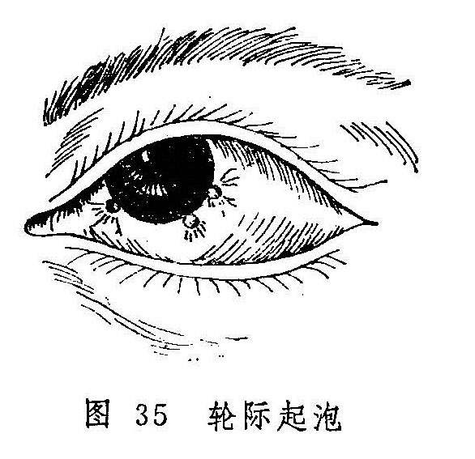
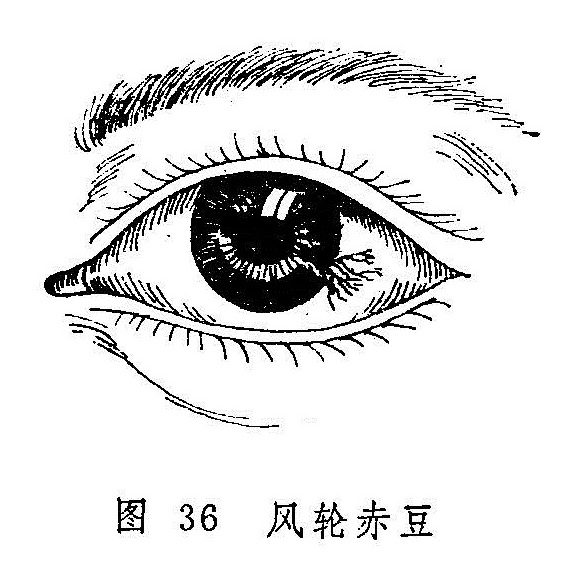

## 轮际起泡　风轮赤豆

轮际起泡是指风轮边际发生灰白或灰黑色泡状颗粒的病证（图35）。病名见于《目科捷径》，原称为“乌睛白睛之间起黑白泡”，现简称轮际起泡。病名虽云“起泡”，其实和发生于白睛表层的金疳颗粒形态相似，属实心性小颗，并非水泡。颗粒可为一个或多个，较金疳之颗粒虽小，但因发生于风轮边际，患眼睑闭难睁、疼痛、羞明、流泪等症状较金疳剧烈得多。失于治疗，还可导致风轮穿破的严重后果。

风轮赤豆是指风轮上有颗粒突起，其上及周围有赤丝缠布，色红如赤豆的病证（图36）。《证治准绳》称为“轮上一颗如赤豆证”，现简称为风轮赤豆。本证常反复发作，愈后遗留瘢痕而影响视力。

轮际起泡和风轮赤豆均常发生于儿童与青少年，前者出现数日后顶部发生溃陷，以后或可消退，或可逐渐向风轮中央进犯，并有血管随之长入，使病变呈红色而如赤豆，即转为风轮赤豆证。后者的形成与前者有密切的联系，故尔合并讨论。

〔病因病机〕

1.肺火壅盛，金胜凌木，故致小泡生于黑睛边际，且能进一步向风轮中央进犯。

2.肺阴不足，虚火上炎，攻于目窍。

3.肝经火盛，热郁于目，使眼部血络瘀滞，郁结而为赤丝攀附于病变部位。

4.素体虚弱，或久病（如麻疹、顿咳、腹泻等）之后脾胃虚损，运化失职；或久居潮湿阴暗之处，致气滞痰停，痰气混结于风轮。

〔辨证论治〕

（一）辨证要领

轮际起泡证初起，病人自觉碜涩流泪，疼痛羞明，风轮边际出现一个或数个微隆起的实质性小泡疹，泡疹附近之白睛亦发红赤。数日后泡疹顶部发生溃陷。此为肺火凌克肝木而致，除眼部症状外，往往可在颈侧触及臖核。

轮际起泡形成的溃陷，数日后可逐渐消失，白睛红赤亦随之而愈。但本病可反复发作，溃陷亦可久不平复。此种类型，兼有口干鼻燥，舌红，脉细数者为肺阴不足，虚火上炎所致；若伴面白少华，颈侧臖核成串，四肢乏力，舌淡脉弱者，则为脾胃气虚且挟痰湿之证。

轮际的泡疹有时可渐向黑睛中央发展，赤丝自气轮成束状追随缠布，状如彗星，直达风轮表面，色红如赤豆，此则多属肝经积热而成。赤豆日渐增大，并可溃破，亦可自行消退。溃破后中间凹陷，愈后留下瘢痕而影响视力。风轮赤豆亦可时发时止，发作时红赤疼痛，羞明流泪；休止时色淡白，诸证缓解。如此反复发作者，亦可据全身症状辨为阴虚火旺或脾虚挟痰。

（二）论治要点

此二证患者大多素体虚弱，受邪发病，故多虚中挟实之证，论治当辨明虚实主次，偏重实者以清肺肝为主，偏重虚者，以调理脾胃或养阴清肺为主。

（三）常见证治

1.内治：

（1）肺火侵肝：

证候：风轮与气轮交界处骤起小泡，与病变相应处白睛红赤，碜涩疼痛，羞明难睁，热泪如汤，烦躁口渴，脉或右寸数大。

治法：抑金泻肺。

方例：抑金散〔115〕。

（2）肝经热炽：

证候：泡疹溃破并向黑睛中央发展，上有赤脉缠布，状如赤豆，热泪如汤，疼痛羞明，或兼见口苦咽干，舌红苔黄，脉弦数。

治法：泻肝清热。

方例：洗肝煎〔153〕。

（3）脾虚挟痰：

证候：轮际起泡或黑睛赤豆反复发作，时隐时现，涩痛随之时作时止，颈侧可触及臖核成串，面色不华，四肢乏力，舌淡苔薄，脉濡或弱。

治法：健脾益气，化痰散结。

方例：香贝养荣汤〔162〕。

（4）肺阴不足，虚火上炎：

证候：轮际起泡或黑睛赤豆反复发作，白睛红赤较轻，溃陷不易消退，口干多饮，或伴干咳，舌红，脉细数。

治法：养阴清肺。

方例：养阴清肺汤〔154〕。

2.外治：

（1）外用朱砂煎〔96〕或涩化丹〔177〕点眼。

（2）根据证情，必要时滴用扩瞳剂，以防瞳神干缺。

（3）可视证情，选用热敷。

（四）临证权变

抑金散适用于以肺火壅盛为主之证型。若肺肝之热邪均盛，则可将抑金散与洗肝散合而加减。若赤豆丝脉粗大，色鲜红，又可用洗肝散合导赤散，并加丹皮、红花以凉血化瘀。若赤豆侵及黑睛中部，可加龙胆草以增泻肝清热之效。证属胆经湿热者，亦可选用龙胆泻肝汤〔58〕。溃陷久不平复，还可用补中益气汤〔103〕升举清阳，使目受温养而自愈。

〔调护〕

平素应注意锻炼身体，增强体质，加强营养，减少复发。

〔文献摘录〕

《目科捷径•乌睛白睛之间起黑白泡》：“凡人乌睛白睛之间起黑泡白泡者，皆气血两虚故也。其泡或青、或黑、或白，大小不一，其疼无比。既已气血两亏，再服苦寒必败。……仍以十全大补汤调理。若失禁忌，必有残患之虞。”
