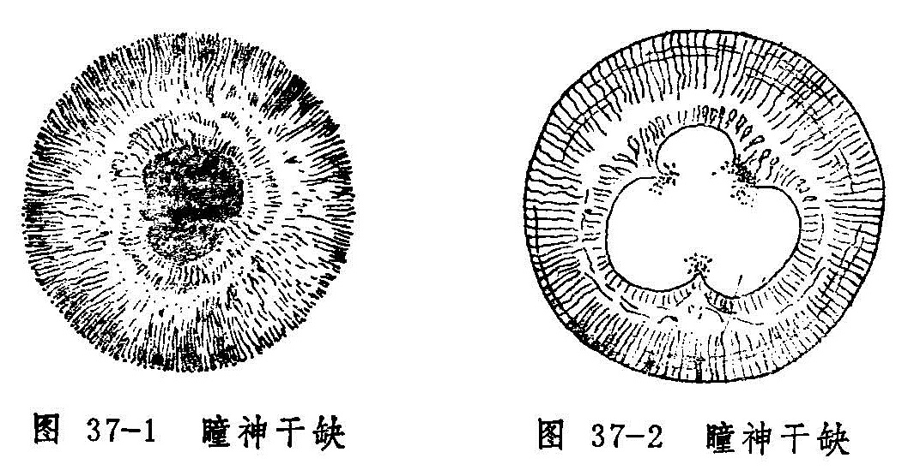

## 瞳神紧小　瞳神干缺

瞳神失却其正常之展缩功能，持续缩小，甚至小如针孔，称为瞳神紧小。本病名首见于《证治准绳》，《审视瑶函》则称为“瞳神缩小”。本病多属阳邪致病，临床表现以实证多见，故《原机启微》称本病为“强阳（阳邪过亢）搏实阴（阴精未亏）之病”。

瞳神失却正圆状态，边缘有缺损，甚或参差不齐，形如梅花、锯齿，或虫蚀的病证，称为瞳神干缺。病名首见于《秘传眼科龙木论》，《一草亭目科全书》称为“瞳神缺陷”。

瞳神紧小与瞳神干缺见症虽有差别，实则同为黄仁病变引起。瞳神干缺多为瞳神紧小失治而成。二者病因复杂，且易反复发作，缠绵不愈。若治疗失当，往往并发它症而导致失明。

瞳神紧小因具有白睛红赤或抱轮红赤，故须与绿风内障、暴风客热、天行赤眼相鉴别。本病与绿风内障的鉴别；暴风客热和天行赤眼二病虽有白晴红赤，但无抱轮红赤，近黑睛处红赤较淡，其余部位红赤较甚，瞳神大小及展缩正常，风轮明洁，有眵泪可见，能尔我相传等，皆与瞳神紧小有别。

〔病因病机〕

1.由肝经风热或肝胆火毒上攻。

2.劳损肝肾，虚火上炎。

3.外受风湿，郁久化热，风湿与热合而上攻。

4.目患火疳、花翳白陷、凝脂翳、混睛障、疳疾上目、蟹睛证、真睛破损以及狐惑病邪毒攻目者，均能导致发病。

以上诸种因素皆可导致邪热深入眼内，蒸灼神水，伤及黄仁、以致黄仁展而不缩，瞳神紧小；火盛水衰，阴精耗伤，瞳神失于濡养，则干缺不圆。

〔辨证论治〕

（一）辨证要领

瞳神紧小初起，证见头痛时发眼痛拒按，入夜尤甚，赤涩流泪，羞明难睁，视力锐减，眼睑红肿，抱轮红赤。甚者白睛混赤，神水混浊，或见絮状物。黄仁肿胀晦暗，纹理不清，瞳神紧小，甚者缩小如针孔，展缩失灵。重证尚可并发黄液上冲之证。

瞳神紧小因系毒邪攻于黄仁，失治则黄仁易与其后之晶珠粘着，以致瞳神偏侧不圆，即为瞳神干缺证（图37-1）。粘着范围较广泛者，瞳神边缘参差，甚则瞳神紧缩如针孔、粟米、阴看不大，阳看不小。此证的瞳神可为黑色，亦可因内结膜障，瞳变白色或微黄，或因邪攻睛珠而令混浊，使并发内障而瞳现青白（图37-2），如此则神光被隔而目盲。

瞳神紧小的发病有急有缓，发病急骤者病势较重，初期多实证，常为外感风、热、湿邪或内有肝胆郁热而起；发病较缓者病势较轻、病情进展缓慢，常缠绵不愈，且易反复发作。其发病多属虚实夹杂之证，常因肝肾阴亏，火炎于上而发，抑或他病久患，阴血耗伤而邪热未除，转化而来。临证时，应结合全身证情进行辨证。至于病至后期，邪气已退，而目暗不明者，多为肝肾阴亏，目窍失养之故。

瞳神干缺证的辨证论治方法与瞳神紧小证同。干缺的形成，多由肝胆蕴热或阴虚火旺而致。日久则局部粘着凝聚，邪毒虽去，瞳神干缺终难复原。

（二）论治要点

瞳神紧小证属瞳神疾患之重证，常致目中精气俱伤，神光散没。所以《证治准绳》指出，本病务宜“乘初早救，以免噬脐之悔也”。一旦形成瞳神干缺，即难免如《龙木论》所云，“名医拱手无方救，堪叹长年暗室居。”

本病辨证论治的关键，在于发病的缓急、眼部证候的轻重和全身兼证的不同。病势急重者多为实证，实证多采用祛风、除湿、清热、解毒、凉血、散瘀等法；病势轻缓者多属不足或虚实夹杂之证，治则常用滋补肝肾或滋阴降火之法。本病因其它疾患如火疳、花翳白陷、凝脂翳、混睛障、疳疾上目、蟹睛证及狐惑病等引起者，必须积极治疗原发病，并参考本病的辨证论治方法，才能收到理想的效果。

对本病施以内治的同时，必须重视局部用药，及时扩瞳，以防瞳神干缺。

（三）常见证治

1.内治：

（1）肝经风热：

证候：起病较急，瞳神紧小，眼珠坠痛，视物模糊，羞明流泪，抱轮红赤，神水混浊，黄仁晦暗，纹理不清。全身可见头痛发热，口干舌红，舌苔薄白或薄黄，脉浮数。

治法：疏风清热。

方例：新制柴连汤〔244〕。

（2）肝胆火炽：

证候：发病急骤，瞳神甚小，黄仁肿胀晦暗，展缩失灵，珠痛拒按，痛连眶额，热泪频流，抱轮红甚，黑睛水膜内壁有细小颗粒附着，神水混浊，或兼黄液上冲，伴烦躁易怒，头痛眩晕，口苦咽干，舌红苔黄，脉弦数等。

治法：清泻肝胆。

方例：龙胆泻肝汤〔58〕加石决明、夏枯草、茺蔚子等。

（3）风湿夹热：

证候：发病或急或缓，多见病情缠绵。瞳神紧小或干缺，目赤痛，眉棱、颞颥闷痛，视物昏矇，眼前或见黑花，神水混浊，黄仁纹理不清，伴全身肢节痠痛，头重胸闷，舌红苔黄腻，脉弦数或濡数。

治法：祛风清热除湿。

方药：抑阳酒连散〔113〕。

（4）肝肾阴亏，虚火上炎：

证候：病势轻缓，或病至后期，或缠绵不愈，时轻时重，反复发作，瞳神多干缺不圆，伴见时而赤痛，干涩不适，视物昏花，或兼头晕失眠，五心烦热，口燥咽干，舌红少苔，脉细而数等。

治法：滋阴降火。

方药：滋阴地黄丸〔229〕。

2.外治：

（1）局部点用扩瞳剂 发病之初即用药物迅速充分扩瞳，既可防止瞳神干缺，又有助于缓解眼部疼痛。常用药为1%阿托品液或软膏，每日点患眼1〜3次，或视病情而定。

（2）滴用清热解毒眼液 如10〜50%千里光眼液〔24〕或10%黄连素眼水〔214〕。

（3）局部热敷 常用热水或内服药药渣煎水作湿热敷，有助疏散瘀滞、退赤止痛的作用。

3.针刺疗法：

（1）体针：常用穴：睛明、攒竹、瞳子髎、丝竹空、肝俞、足三里、合谷。每次局部取二穴，远端配一至二穴。

（2）耳针：可取耳尖、神门、眼等穴。

（四）临证权变

本病的临床表现极为复杂，患者之间的差别颇大，并可出现多种并发症与后遗症。如若病势急重，赤痛较甚者，可在前述相应的方药中选加生地、丹皮、丹参、茺蔚子凉血活血，增强退赤止痛的作用。如属肝胆火毒炽盛，伴见黄液上冲证，需参考有关章节辨证论治；若热入营血，伤及黄仁血络，导致血灌瞳神者，则可见心烦口渴，舌绛脉数等证，治宜清热解毒，凉血止血。方用清营汤〔199〕加赤芍、紫草。若属风湿偏盛，热邪不重者，又当慎用寒凉之品，酌加白蔻、苡仁、茯苓、厚朴等宽中利湿。

另外，病势轻缓，但经久不愈，反复发作，或久服凉药脾胃被伤者，亦有少数属脾胃虚寒者，多伴畏寒喜热，肢冷便溏，舌淡苔薄，脉象沉细等，宜用调中益气汤〔178〕益气升阳，使目窍得养而向愈。

〔调护〕

1.本病饮食宜忌辛辣酒浆，肥甘厚味，以免助湿生热，加重病情。

2.忌房劳、免精伤而虚火上攻。

3.嘱患者勿坐卧湿地，注意劳逸适度，防止竭视伤目，以免加重病情或愈后复发。

〔应用例案〕

吴XX，女37岁，初诊于1961年3月20日。原由风湿，骨关节疼烦时作，近则上害空窍，右目红肿，瘀滞疼痛剧烈，瞳神缺曲不圆，视糊，头亦牵痛，舌白微腻，脉浮缓。邪在肌表治以汗解，麻黄杏仁苡薏甘草汤，二剂。

二诊：红减，诸痛缓解，惟目视不复，邪气留恋，当再驱风湿以治。羌活、独活、防风、防己、米仁、泽泻、苍术、滑石、黄芩，三剂（以后又服五剂）。

四诊：红退肿消，目视恢复，关节疼痛亦除。防疾之复燃，当再予原方增损。原方去米仁，五剂。（《眼科证治经验》）

〔文献摘录〕

《审视瑶函•瞳神缩小》：“此症谓瞳神渐渐细小如簪脚，甚则缩小如针也。视尚有光，早治少挽，复故则难……皆宜乘初早治，不然悔之不及也。”

《眼科七十二症全书•瞳仁干缺外障》：“瞳神干缺者，亦系内障，与外无预。此因头痛而起，故列外障条中。按此症多因肾虚肝热，致冷瞳仁干缺，亦因夜卧不安，肝藏魂，肺藏魄，魂魄不安，神情不定而少睡，劳伤于肝，致令金井而不圆，上下东西，锯齿匾缺参差矣。则渐细小，视物矇矇，难辨人物，相牵俱损。……此症或失于医治，久久多锁紧如小针眼大，内结有云翳，或黄或白或青，阴看不大，阳看不小，遂成瞽矣。”
