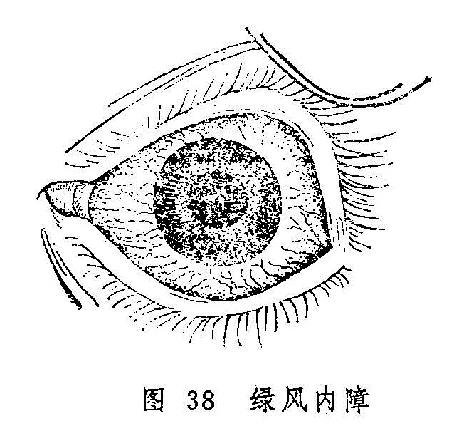

## 五风内障

五风内障，包括青风内障、绿风内障、黑风内障、乌风内障、黄风内障等五种病证。因此五种病证的后果严重，善变似风，故皆名之曰风。早在《外台秘要》已有黑盲、乌风、绿翳、青盲等病名的记载，但到《秘传眼科龙木论》才系统地归纳为前述五种病名。

《秘传眼科龙木论》尚有“五风变内障”一证，《证治准绳》详称为“五风变成内障证”，乃先患五风内障而“后有脑脂如结白，真如内障色如霜”，实指部分五风内障后期瞳神内结成的白色翳障。不可与五风内障混同为一。

参考古代文献及临床所见，现将五风内障的临床表现和辨证论治介绍如下：

〔青风内障 乌风内障〕

头痛眼胀不甚剧烈，视物日渐昏矇，瞳神气色呈淡青色的病证称“青风内障”。

瞳神气色昏暗，视力日渐模糊，头目不痛不痒，终至不见三光之病证，称为“乌风内障”。乌风内障头目不痛不痒，唯视力逐渐模糊，终至失明，与青盲的发病过程极相仿佛。但青盲眼的外观一如常人；乌风内障的后期，瞳神常见气色昏矇，《证治准绳》谓其“如暮雨中之浓烟重雾”，且眼珠逐渐变硬，与青盲是不同的。

青风内障与乌风内障均是视力逐渐下降的病证。青风内障虽有头目胀痛，或伴抱轮红赤，但不甚剧烈。乌风内障虽无痒痛但与青风内障一样，均能缓慢地导致失明。两证的病因病机也无截然区别，故将二者合并讨论。

〔病因病机〕

1.忧愁忿怒，肝郁气滞，气郁化火。

2.脾湿生痰，痰郁生热，热痰升扰。

3.竭思劳神，用意太过，心血亏耗，虚热引动肝经风火上扰。

4.劳倦过度，淫欲不节，肾精耗伤，阴不潜阳，虚火上扰。

以上因素皆可导致气血郁闭，脉络不利，神水瘀滞，而酿成本病。

〔辨证论治〕

（一）辨证要领

青风内障初起，可无明显的自觉症状，或有轻度的头额疼痛，眼珠轻度胀痛，视物时明时矇，或有目晕（观灯火有彩色晕环），视力渐渐下降，瞳神大致正常。遇有过度疲劳，或情志不舒，则上述症状加重，抱轮微赤，黑睛失去光泽，瞳神内呈淡青气色，如青山被淡烟笼罩之状。稍事休息，或情绪平静之后，则诸证悉减。如此头目胀痛反复发作，视力日降，终可失明。也可因失治或暴怒忿郁而证情加剧，视力锐减，瞳神散大，而变为绿风内障。本证以妇女多患，且常一眼先患，后乃相牵俱损。

乌风内障的发病前期，眼无胀痛，外观俨如常人，唯觉目光逐渐昏矇。随着病情的进展，眼珠渐生胀硬，自觉胀困不舒，却无明显疼痛及白睛红赤，但金井内可见浑浊如烟。病至后期，因精气渐耗，瞳神散大，光华日损，终至不辨三光。本病证以男性略多，亦常一眼先患，后乃相牵俱损。本证的病程较长，日久瞳内之睛珠可凝结成青白色内障，此时不可误诊为单纯的如银内障。乌风内障最宜早期诊治。然因早期一般症状不明显，故而常被忽视，待到晚期就诊，患目神光已微，视力已难挽回，失明在所难免。

此两证的辨证，当注重肝、脾、心、肾四脏。肝经以肝郁气滞，肝火上扰多见；脾经则多为脾胃不和，聚湿生痰而化热，痰热上攻之证；心经以血亏而虚火上炎为多；肾经多为肾精不足而阴不潜阳而致。当结合全身症状而详辨。

（二）论治要点

青风内障和乌风内障的证情比较缓和，但治疗并非易事，需认真进行辨证论治，如可获效。临床上，表现为肝郁气滞，脉络瘀阻者最为多见。所以，疏肝解郁及化痰清热通络为治疗本病的重要治法。

青风内障和乌风内障贵在及早救治，晚则难疗而不免失明。青风内障之重证及乌风内障的后期，均可致瞳神散大，神光微弱。此则务必配合点用缩瞳剂，瞳神得收，则神光得聚，治可收效。否则瞳神愈散愈大，神光散耗，难免失明。

（三）常见证治

1.内治：

（1）气郁化火：

证候：多缘情志不舒而发。证见心烦易怒或抑郁不乐，头目胀痛，胸胁满闷，食少神疲，心烦口苦，舌红苔黄，脉弦细。

治法：清热疏肝。

方例：丹栀逍遥散〔78〕。

（2）痰火升扰：

证候：头眩目痛，心烦失眠，痰多食少，胸闷恶心，口苦舌红，苔黄而腻，脉弦滑或滑数。

治法：清热祛痰，和胃降逆。

方药：黄连温胆汤〔213〕。

（3）心血亏虚，风火上扰：

证候：劳倦或久视后眼证加重，头眩眼胀，瞳神略有散大，视物昏矇，失眠健忘，五心烦热，口燥咽干，舌绛少苔，脉细数。

治法：滋阴养血，柔肝熄风。

方药：阿胶鸡子黄汤〔128〕。

（4）肝肾不足：

证候：病久瞳神微散，眼珠胀硬，神光渐微，伴见头晕耳鸣，失眠健忘，腰膝痠软，舌淡脉细，或兼面白肢冷，精神倦怠，舌淡苔白，脉沉细无力。

治法：补益肝肾。

方例：肝肾阴精亏损者，用杞菊地黄丸〔126〕，肾阳不足者，可酌选金匮肾气丸〔149〕，右归丸〔55〕。

2.外治：瞳神散大者，当局部点用缩瞳剂。如用1〜2%毛果芸香碱液，每日滴眼3〜4次，亦可视病情而定。

3.针刺疗法：

（1）体针：常用穴：睛明，攒竹、瞳子髎、阳白、四白、太阳、风池、翳明、合谷、外关等。恶心呕吐时可配内关、足三里。头目部每次取2穴，远端取2穴。亦可选攒竹、太阳、丝竹空等处开导出血，以疏郁滞。

（2）耳针：目1、目2、眼等，亦可刺耳尖穴放血。

（四）临证权变

青风内障发病后，不但可以恶化变为绿风内障，而且可在前述证型之间相互转化。乌风内障一般不转化为绿风内障，但临床表现亦比较复杂。所以对青风内障和乌风内障的治疗，需进行灵活的辨证论治，且不可墨守一法一方。

遇肝气郁滞导致者，若郁而化火生风，证见抱轮红赤明显，头晕目痛稍剧者，可在丹栀逍遥散的基础上选加夏枯草、菊花、钩藤，羚羊角以增其清热平肝熄风之力；若因郁火而阴血亏损较甚者，又可加熟地、女贞子、桑椹子滋阴养血；若肝经郁热与痰火升扰并见者，则可将丹栀逍遥散与黄连温胆汤合用，以收疏肝清热，祛痰之功。

患病日久，每可见肝肾不足之证型。肝肾不足又当分肝肾阴亏及肾阳不足两种情况处理。若遇肝肾阴亏之患者，又兼五心烦热，舌边尖红，苔薄少津，脉弦而细者，证属肾精不足，肝火上亢，可选用乌风补肝散〔42〕滋阴清肝；肝肾两亏又兼气血不足者，可在杞菊地黄丸或金匮肾气丸的基础上酌加党参、黄芪、当归、川芎等。

青风内障变为绿风内障者，又当参照绿风内障辨证论治。

〔绿风内障 黑风内障〕

头眼剧烈胀痛，恶心呕吐，视力急趋下降，瞳神散大，气色呈隐隐绿色的病证，称为绿风内障（图38）。绿风内障之名首见于《秘传眼科龙木论》，但在《外台秘要》已有关于本病的记述，谓：“瞳子翳绿色者，名为绿翳青盲，皆是虚风所作，当作急须即疗。……若眼自暗多时，不可复疗。此痰之源，皆从内肝管缺，眼孔不通所致也。”

头眼胀痛，瞳神散大，视力下降，但瞳神仍为黑色者，称为黑风内障。

黑风内障与绿风内障同为急重之证，头眼胀痛，瞳神散大，视力下降，失治则神光绝灭。但绿风内障瞳神内色呈淡绿，黑风内障则色呈昏黑，是为不同。

绿风内障、黑风内障与前述瞳神紧小均有眼痛及抱轮红赤或白睛混赤，故当与瞳神紧小证相鉴别（表5）。

表5 绿风、黑风内障与瞳神紧小证的鉴别

| 疾病\鉴别要点\项目 | 绿风、黑风内障                           | 瞳神紧小证                                                   |
| ------------------ | ---------------------------------------- | ------------------------------------------------------------ |
| 视觉               | 视力骤降，伴目晕                         | 视力减退，无目晕                                             |
| 疼痛               | 患侧头痛剧烈，眼珠胀痛欲脱               | 患眼坠痛，痛连眉骨、颞部                                     |
| 眵泪               | 一般较少                                 | 流泪                                                         |
| 白睛               | 抱轮深红或白睛混赤                       | 抱轮红赤                                                     |
| 黑睛               | 水膜混浊如雾，黄仁展缩失灵               | 水膜一般透明，但内壁下分有白色点状附着物，甚者神水混浊，或伴黄液上冲 |
| 瞳神               | 散大，收缩失灵，瞳神内呈淡绿色或仍为黑色 | 紧小，开大失灵，常伴干缺，瞳内或黑或白                       |
| 眼珠硬度           | 增高                                     | 正常或减低                                                   |
| 呕恶               | 伴恶心呕吐                               | 无                                                           |

绿风内障与黑风内障的病因病机、治疗方法均无截然区别，故将二者合并讨论。

〔病因病机〕

1.素体肝旺，肝火亢极而生风，风火攻目。

2.情志过伤，肝失疏泄，气郁化火，上凌清窍。

3.脾湿生痰，痰郁化热生风，肝风痰火流窜经络，上扰清窍。

4.劳神过度，真阴暗耗，水不制火，虚火上炎，或肾脏虚劳，水不涵木，肝阳失制，亢而生风，风痰上扰。

5.肝胃虚寒，饮邪上逆。

以上阴阳偏盛，气机失常诸种原因，均可导致气血失和，经脉不利，目中玄府闭塞，神水瘀积，酿成本病。

〔辨证论治〕

（一）辨证要领

绿风内障可由青风内障发展而来，也可未患青风内障而突然发病。发病前，常在情志刺激，或劳神过度后，自觉眼珠微胀，同偏头额作痛，鼻根发痠，视灯火有目晕，视物昏矇，如隔云雾等，休息之后，诸症尚可缓解。

上述证候失治，即可急性发作，病势急暴，头痛如劈，眼珠胀痛欲脱，痛连目眶和鼻根，视力急骤下降，甚至仅辨明暗或完全失明。检查患眼，可见胞睑轻微红肿，白睛混赤，黑睛混浊如雾，瞳神散大，瞳内气色略呈淡绿或黄绿，触之眼珠坚硬，甚者如石，兼见恶心呕吐，或伴发热恶寒。此时及时救治，诸证可以缓解，视力尚能恢复。如果延误失治，眼珠胀硬不减，则瞳神可愈变愈黄，转为黄风内障而失明。

绿风内障常由一眼先患，后乃相牵俱损，也有两眼齐发者。经过治疗，亦可转入慢性阶段，诸证减轻，但遇情志不舒，或过度劳累等，又可急性发作。如此反复发作，瞳神愈散愈大，神光日渐衰微，终至完全丧失。

黑风内障的临床表现与绿风内障相类似，惟其发病之初，眼前时见黑花，瞳神散大，但色呈昏黑，久则失明，不辨三光。

绿风内障与黑风内障多属实证，主要由风、火、痰、郁上干目窍而致。气血郁滞则经脉不利，风、火、痰邪阻滞则玄府闭塞，珠内气血津液因之不行，神水瘀滞故而眼珠胀硬，脉络闭塞故头目剧痛。

绿风与黑风之发，肝脏功能失调最为要害。因前述上干之风、火，实为肝风、肝火；痰湿之邪，经肝经风火之煽，才能上攻目窍而致病；至于肾阴虚、肝阳亢而上扰，阳气虚、肝寒犯胃而饮邪上泛，也均与肝之阴阳失调有关，所以诊疗绿风内障、黑风内障，应抓住肝经这个关键。

（一）论治要点

绿风内障与黑风内障均属急重眼病。其急性发作者以“肝胆火炽，风火攻目”，“痰火动风，气火上逆”、“肝胃虚寒，阴浊上泛”引起者最为多见。此三种类型，均可见剧烈的头目疼痛和红赤，以及瞳神散大，恶心呕吐、头晕而昏等证。分辨三者的关键，在于全身兼证及舌脉的不同：肝胆火炽，挟风攻目者，常见口苦咽干，舌质红，苔薄黄，脉弦数等证；痰火动风，气火上逆常为久患头风所致，常兼身热面赤，动则眩晕，胸脘满闷，舌红苔黄腻，脉弦滑数等；肝胃虚寒，阴浊上泛者常兼痛及巅顶，干呕或呕吐涎沫，四肢不温，舌淡苔白，脉沉弦等证。

属于肝郁气滞，气火上逆导致的亦为常见，其发病多与情志不舒有关。但这里所指者多为发病较缓或急暴发作后转为慢性者。由于忿怒暴悖导致肝经郁火挟风上攻，引起急性发作者，因其证候剧烈，当属“肝胆火炽，风火攻目”型，治法当与肝郁气滞，气火上逆者不同。

“阳虚阳亢，风阳上扰”亦多为急性发作后的慢性期，常兼心烦失眠，眩晕耳鸣，口燥咽干，舌红少津，脉细数等虚热证象，不难分辨。

脾胃虚寒，阴浊上泛者，可为急性发作，也可见于慢性发作。凡兼痛连巅顶，神疲肢冷，食少便溏，舌淡苔白，脉沉弦者，不论证候缓急，均当辨为本证。

各型患者的证候并非一成不变。急性发作之后，仍因情志因素而反复发作，缠绵不愈者，即可辨为肝郁气滞型；久病阴伤，眼部症状较缓而兼阴津耗伤证候者，又属阴虚阳亢型；证情轻缓而又急性发作者，又可依临床表现的不同，辨为肝胆风火炽盛、痰火动风、肝胃虚寒而阴浊上犯诸型。

绿风内障、黑风内障均有瞳神散大之主证，瞳神不收则神光终将绝灭。故而及早点用缩瞳药亦为本病治疗的关键。

（三）常见证治

1.内治

（1）肝经风热上攻：

证候：发病急暴，头目剧痛，瞳神散大，抱轮红赤，兼见恶寒发热，或周身不适，呕吐恶心，舌苔薄黄，脉浮数或弦数。

治法：疏风清热，和血散瘀。

方例：清震汤〔203〕。

（2）肝胆火炽，挟风上扰：

证候：发病急剧，头痛如劈，眼珠胀痛欲脱，连及目眶，视力急降，抱轮红赤或白睛混赤，可伴白珠外膜浮壅胀起，甚或高于风轮，黑睛混浊如雾，瞳神散大，色呈淡绿，眼珠胀硬，甚者如石。全身或伴恶寒发热，恶心呕吐，口苦咽干，溲赤便结，舌红苔黄，脉弦数等。

治法：平肝、泻火，熄风。

方例：绿风羚羊饮〔224〕加减。

（3）痰火动风，上阻清窍：

证候：起病急骤、头眼剧痛诸症与肝胆火炽者同。常伴身热面赤，动辄眩晕，胸脘满闷，恶心呕吐，溲赤便结，舌红苔黄腻，脉弦滑数等。

治法：清热豁痰，平肝熄风。

方例：将军定痛丸〔159〕。

（4）肝郁气滞，气火上逆：

证候：眼部主证俱备，兼有情志不舒，胸闷胁胀，食少纳呆，呕吐泛恶，口苦，舌红苔黄，脉弦数等。

治法：清热疏肝，降逆和胃。

方例：丹栀逍遥散〔78〕合左金丸〔54〕。

（5）阴虚阳亢，风阳上扰：

证候：头目胀痛，瞳神散大，视物昏矇，视灯火有目晕，眼珠变硬，心烦失眠，眩晕耳鸣，口燥咽干，舌红少苔，或舌绛少津，脉弦细而数或细数。

治法：滋阴降火，平肝熄风。

方例：阿胶鸡子黄汤〔128〕。

（6）肝胃虚寒，阴浊上泛：

证候：除眼珠胀痛，瞳散视昏等眼部症状外，兼见头痛上及巅顶，干呕或呕吐涎沫，食少神疲，四肢不温，舌淡苔白，脉沉弦。

治法：温肝暖胃，降逆止痛。

方例：吴茱萸汤〔121〕。

（7）肝肾两亏，气虚邪恋：

证候：多见于绿风内障缓解之后，但仍反复发作者。因病久正伤，而见腰膝痠软，面热足冷，神情疲惫，舌淡苔白，脉象细弱等。

治法：培补肝肾，益气散邪。

方例：绿风还睛丸〔223〕。

2.外治

局部宜及早频用缩瞳剂。如用1〜2%毛果芸香碱液，重证每15〜30分钟滴眼一次。证情缓解后，可视病情改为1〜2小时一次，或每日2〜3次。

3.针刺疗法：参考青风内障、乌风内障。

（四）临证权变

绿风内障、黑风内障的临床表现十分复杂，前述证候类型只是举其大略，临证应当举一反三，灵活运用，灵活加减，才能收到较好的疗效。例如，属肝胆火炽与痰浊上泛相兼者，可用羚羊钩藤汤〔208〕平肝熄风，除湿化痰；证属阴虚阳亢、风阳上扰者，阿胶鸡子黄汤最适用于血虚生风、肝阳上亢者，如果眩晕耳鸣、腰膝酸软、遗精腰痛等证明显，属于肾经阴精不足而阴不潜阳，虚阳上扰者，则可用知柏地黄丸酌加石决明、钩藤以滋阴降火，平肝熄风。急性证候缓解，而呈慢性发作，久不痊愈者，亦可参照青风内障、乌风内障辨证论治。

〔黄风内障〕

神光绝灭，瞳神散大，气色混浊呈浑黄色的病证，称黄风内障。黄风内障在《秘传眼科龙木论》的“五风变内障”中已经提到，但未加阐述。《证治准绳》始对黄风内障的临床表现予以详述。本病是由绿风内障失治而成，为五风内障的后期阶段，多为肝风痰火上乘或肝经郁热上冲，瞳神被烁，神膏耗损所致，证见瞳神散大，甚则黄仁缩窄一周如线，金井内气色混浊不清，呈浑黄色，人物不辨，重则不辨三光，或仍兼有头目胀痛等症。

“高风雀目”后期瞳变金黄之色，《医宗金鉴》亦称之为“黄风内障”，但不属本节讨论的范围。彼则系睛珠色呈金黄，有夜盲史，病多发于幼年，无头目疼痛，亦无目赤、珠硬及瞳神散大等改变。此则风轮失去光泽，睛珠呈浑黄色，为神光将绝或已绝之候，药物难以奏效。

本病虽失明且治难奏效，但尚有目珠胀痛者，可参考绿风内障的处理方法，以图止痛之效。

〔调护〕

五风内障的病因比较复杂，目前尚难从根本上防止发病。一般应从早期诊断和早期治疗方面努力，避免导致失明的严重后果。对本病患者应采取以下措施：

（1）向病人做好解释安慰工作，解除思想顾虑，积极配合治疗。病人应心情舒畅，注意劳逸结合，生活宜有规律。

（2）久视则伤血。故宜少看电影、电视，以免耗伤阴血，神光被损。

（3）饮食宜清淡，忌辛辣肥甘，禁止烟酒。

（4）保持大便通，以免浊气上攻。

〔应用例案〕

例一：张XX，女，66岁，初诊于1962年2月14日。原由头风攻害，左目“黄风内障”，瞳神阔大，失明近年，惟右目近亦昏糊，眼前发花，疼痛痠楚，开张乏力，有时目晕如虹，虽瞳神未见变化，实为“青风”之象。口干舌燥，头痛昏胀，舌质红绛，脉细弦，此皆肾阴不足，水不涵木，肝阳偏亢，化风上窜巅顶，治当滋阴潜阳，镇肝熄风。鲜生地、麦冬、赤白芍、玉竹、炙鳖甲、炙龟板、生牡蛎、怀牛膝、钩藤、黄菊花、五味子。七剂（以后以原方增损连服一月）。

六诊：头目疼痛已除，左目视糊，目晕亦相应消失，口干尚见，舌红，脉虚。风邪先平，虚火还炽，当再予滋阴降火以防痰之复燃。沙参、麦冬、五味子、玉竹、石斛、白芍、炙鳖甲、炙龟板，七剂。服二月，体征消失。（《眼科证治经验》）

例二：刘XX，男，42岁，农民。1972年4月25日初诊：二目胀痛，头部剧痛10余天，曾在某医院诊断为“急性充血性青光眼”，经点服西药，效果不够明显，因惧怕手术治疗，愿服中药治之。检查视力，右眼0.2，左眼0.5。双眼白睛赤胀，青睛混浊，瞳神散大，色呈淡绿，按之目珠石硬（右目较重），此为绿风内障，治以羚羊角汤（羚羊角0.6克，防风6克，知母、元参、茯苓、酒黄芩、车前子、夏枯草各9克，五味子3克），服药六剂。5月3日复诊：白睛淡赤，青睛微昏，瞳神已恢复如常，按之目珠稍硬，以上方去羚羊角、五味子，加酒白芍9克，酒生地12克服至5月14日，诸证皆除，视力，右眼1.0，左眼1.2，嘱其禁忌饮酒，服明目地黄丸3个月。（《张皆春眼科证治》）

〔文献摘录〕

《秘传眼科龙木论》：“青风内障：此眼初患之时，微有痛涩，头旋脑痛，或眼先见有花无花，瞳人不开不大，渐渐昏暗。或因劳倦，渐加昏重”。“乌风内障：此眼初患之时，不疼不痒，渐渐昏沉，如不患眼人相似。……经三五年，内昏气结，成翳如青白色，不辨人物，已后相牵俱损。”“绿风内障：此眼初患之时，头旋额角偏痛，连眼睑骨及鼻颊骨痛。眼内痛涩见花，或因呕吐恶心，或因呕逆后，便令一眼先患，然后相牵俱损。”“黑风内障：此眼初患之时，头旋额角偏痛，连眼睑骨及鼻颊骨时时亦痛，兼眼内痛涩，有黑花来往，先从一眼先患，以后相牵俱损。亦因肾脏虚劳，房事不节，因为黑风内障。”

《证治准绳》：“青风内障证，视瞳神内有气色昏朦，如青山笼淡烟也。然自视尚见，但比平时光华则昏朦日进。急宜治之，免变绿色，变绿色则病甚而光没矣。”“绿风内障证，瞳神气色浊而不清，其色如黄云之笼翠岫，似蓝靛之合藤黄，乃青风变重之证，久则变为黄风。”“黑风内障之证，与绿风候相似，但时时黑花起，乃肾受风邪，热攻于眼。”“黄风内障证，瞳神已大而色昏浊为黄也。病至此，十无一人可救者”。“乌风内障证，色昏浊晕滞气，如暮雨中之浓烟重雾”。