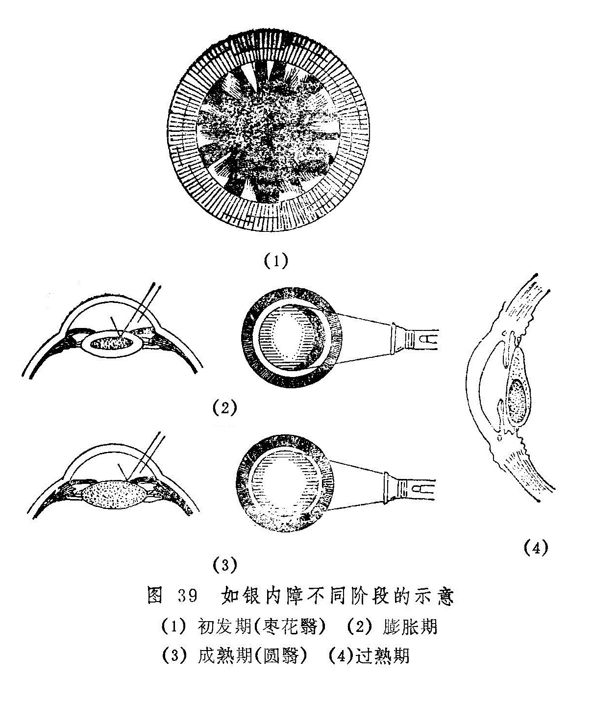

## 如银内障

 五风变内障 冰翳内障

本病是指黑睛混浊，渐成翳障，遮蔽神光，其初视力渐降，终至不辨人物的一种慢性眼病。因其瞳神内色白如银，故称如银内障。

早在《龙树菩萨眼论》就有关于本病的记载，彼则简称“内障”，如云“眼不痛不痒，端然渐渐不明，遂即失明，眼形不移，唯瞳仁里有隐隐青白色，虽不辨人物，犹见三光者，名曰内障。”《外台秘要》则移本病为“脑流青盲眼”，《秘传眼科龙木论》又将本病分为十余种，对其形态的观察十分细致。《证治准绳》始有如银内障之名，其曰：“如银内障证，瞳神中白色如银也。轻则一点白亮，如星似片，重则瞳神皆雪白而圆亮。圆亮者，一名圆翳内障。有仰月、偃月变重为圆者；有一点从中起，视渐昏，而渐渐变大不见者。……年未过六十及过六十而血气未衰者，拨治之皆有复明之理。”可见，如银内障颇类现代所谓老年性白内障，其发病过程颇不一致，可分別先从睛珠的中部、上部、下部、前部、后部、周边部出现白色混浊，然后渐致整个瞳神白而圆亮。白而圆亮者称为圆翳内障，其余则可依其神色形态之不同，分别称作偃月翳、仰月翳、枣花翳、滑翳、涩翳、横翳、散翳、浮翳、沉翳、白翳黄心等（见表6）。名称虽多，其实均为如银内障发病过程中的不同阶段或形态，今故合并讨论。

如银内障初患之时，眼前多见蝇飞花发，或见薄烟轻雾，此则当与云雾移睛证相鉴别（见“云雾移睛”）。

表6 如银内障分类鉴别表（供参考）

| 圆翳内障           | 瞳神内有翳白而白亮，宛如油滴浮于水面，阳看则小，阴看则大 |
| ------------------ | -------------------------------------------------------- |
| 偃月翳内障         | 瞳神内上部有白气一片，隐似新月覆垂向下，上厚下薄         |
| 仰月翳内障         | 瞳神内下部有白气一片，隐似新月，渐渐向上，下厚上薄       |
| 枣花翳内障         | 瞳神内有一周白翳，如枣花锯齿                             |
| 白翳黄心内障       | 瞳神内有翳，外周白色，中心微黄                           |
| 横翳内障（剑脊翳） | 有翳横于瞳内，形如剑脊，中高边薄，色白如银               |
| 散翳内障           | 瞳神内有翳，散如鳞点，乍青乍白                           |
| 浮翳内障           | 瞳神内有翳，白如银针色，十分表浅，暗看大，明看小         |
| 沉翳内障           | 白点隐隐，深藏瞳神之内，向日细看，方见其白               |
| 滑翳内障（包浆翳） | 瞳神内有翳如水银珠子状，微含黄色                         |
| 涩翳内障           | 翳如凝脂，色微赤，或聚或散而无定形                       |
| 黑水凝翳           | 瞳神微散，翳色微现青白                                   |

〔病因病机〕

本病多因年高体弱，气血渐衰，精气日损，目失涵养；或因脾虚，则五脏之精气皆失所司，不能归明于目；或因房事不节，伐伤过度，肝肾两亏所致，或因阴精衰弱，七情内伤，阴虚不能配阳，虚火上乘所致；或因肝郁气滞，郁久化火，及劳心竭思，心火内盛，心肝火炎，蒸灼睛珠而生。

〔辨证论治〕

（一）辨证要领

本病初起，眼无红肿疼痛，仅自觉眼前有点状、片状或条状之固定黑影，随眼珠之转动而移动，似蚊蝇飞舞，或如蜘蛛倒挂，目力缓慢下降，如在烟雾中看物。发病过程中，常因睛珠混浊部位之不同，出现白天（或明处）视昏。夜晚（或暗处）视清；或白天（或明处）视清，夜间（或暗处）视昏，经历年久，渐至失明。双目可同时起病，亦可先后发生。此证除视物昏矇外，无任何头疼眼痛及痒涩，眼外轮廓亦与常人相似，唯见瞳神内隐隐淡白，或浮浅而如油滴浮于水面；或深沉而位于金井深处，不仔细观察则难以发现；或边缘形如枣花锯齿〔图39（1）〕；或如新月弯弯，位于瞳神之一侧；或中厚边薄横于瞳神中央。形形色色，不一而足。当金井内翳障发展成一片青白色，目力已降至不辨人物时，对日、月、火"三光”都仍能感觉，瞳神依然圆整，阴阳开合，展缩如常。有时在发病过程中，由于睛珠混浊相间不匀，偶可出现视一为二。故《原机启微》谓：“其病初起时，视觉微昏，常见空中有黑花，……次则视歧，睹一成二，神水淡白色……。”

如银内障的气色形态虽然多样，但相互之间在发病机制上并无明显不同。所以辨析本病的病机时，主要应依据全身脉证予以辨证。在发病之早期，用内服药物治疗常可提高视力，亦可制止睛珠混浊的进一步发展。若睛珠色呈灰白，已明显障遮瞳神，则药物难以奏效，宜待翳定障老之后，施以手术。

（二）论治要点

如银内障积久年深，瞳神内一片混白时，服药针刺均难奏效。所以用药物内服治疗本病，务须早期进行。因本病多见于老年人，故以肝肾不足和脾虚气虚者最为多见。临床上，滋补肝肾，建脾益气之法则是常用的治疗大法。至于肝肾阴亏又致肝阳上亢者，又当选用育阴潜阳之法。属于肝热上扰者较少见，临证遇之可用前述相应方药论治。

手术疗法是本病十分重要的治疗方法，对圆翳内障已成者，用之有满意的效果。

（三）常见征治

1.内治：

（1）肝肾两亏：

证候：眼前有点、片、条状隐影飘浮，视物昏花，或伴头晕，耳鸣耳聋，腰痠足软，舌质红，少苔，脉细。

治法：滋补肝肾。

方例：杞菊地黄丸〔126〕或明目地黄丸〔145〕。若兼面白肢冷，神疲体乏，溺清便溏，舌质淡脉沉弱等肾阳不足证候者，又当用金匮肾气丸〔149〕、右归丸〔55〕、三仁五子丸〔15〕温补肾阳。

（2）脾虚气弱：

证候：视物昏花，精神倦怠，肢体乏力，面色萎黄，食少便溏，舌淡苔白，脉缓或细弱。

治法：补脾益气。

方例：补中益气丸〔103〕或益气聪明汤〔183〕。

（3）肝热上扰：

证候：头痛目涩，眵泪眊臊，口苦咽干，脉弦。

治法：清热平肝。

方例：石决明散〔48〕。

（4）阴虚阳亢：

证候：头晕耳鸣，腰膝酸软无力。眼干涩昏花，烦躁不眠，唇红颧赤，津少口干，口苦舌红，脉弦。

治法：滋阴降火，育阴潜阳。

方例：七宝丸〔8〕。

2.针刺疗法：适用于早期患看，当与内服药配合使用。常用穴：风池、睛明、球后、攒竹、承泣、鱼腰、瞳子髎、丝竹空、临泣、肝俞、脾俞、合谷、足三里、三阴交等。每日或隔日一次，每次2〜3穴，8〜10次为一疗程。

3.手术疗法：睛珠全混，翳定障老，瞳神展缩如常，光定位及色觉良好者，可用金针拨障术治疗。判断如银内障是否成熟，可用电筒侧照法检查。在其膨胀期，可见黄仁之阴影呈新月形投射于晶珠表面〔图39（2）〕，成熟期则黄仁之阴影消失〔图33（3）〕，即为翳定障老，正宜手术拨治。过期日久则晶珠缩小，翳如冰棱下沉〔图39（4）〕，拨之不易（如银内障针拨术见后）。

（四）临证权变

前述如银内障的四个证候类型，不过举其大略，实际上本病的临床表现十分复杂，需注意灵活变通。

如银内障证属阴血不足，且伴咳嗽痰喘等肺经证候者，可用加味二陈四物汤〔76〕养血化痰；证属肝肾精血两亏，且兼心肝火旺者，可用石斛夜光丸〔45〕滋补肝肾，清心平肝；若素体阴虚，兼挟湿热上扰，证见眼部干涩，烦热口臭，大便不畅，舌苔黄腻等，可用甘露饮〔46〕清热祛湿，兼以养阴。

另外，磁朱丸〔246〕功能补肾水，镇心火，是治疗如银内障的常用成药。本病若属肝肾阴亏，水火未济者，均可参用磁朱丸以治之。

本病属慢性眼疾，服药需积年累月，才能收效。故而前述各方，均可改汤为丸，以缓图之。

〔调护〕

1.虚证者，当勿过劳，节房事，以保精气。

2.属肝火或兼湿者，当忌辛辣，戒烟酒，节肥甘，以免加重病情。

3.术后调护参阅“如银内障针拨术”有关内容。

〔应用例案〕

例一：湖北常XX，男。夜间看书手捂左眼，昏如隔罗，甚以为扰。先到当地医院治疗，经医生检查，确诊为白内障，无法治疗，待成熟时，才能手术。常不欲坐以待瞽，到处治疗，终无效果。一九六三年来我院治疗。

诊断：视其目，右目略带白色，视力表上0.1之大字模糊可见；按其脉，寸尺虚大，惟关部略带沉涩。此乃心肾两亏，中焦郁结，不能升清气于脑，脑脂徐徐下垂，而内障即成。

处方：先将光明、临泣略刺；再服疏肝明目汤（当归、生地、川芎、白芍、茺蔚子、菟丝子、蒺藜、决明子、香附、夜明砂、川黄连、夏枯草、甘草），二十剂，视力稍有增加；此是一种慢性病，常服固睛丸（大黄芪、大熟地、大丽参、白术、远志、蒺藜、柏子仁、知母肉、覆盆子、菟丝子、枣仁、磁石、车前子、甘草）即可。后同乡者来诊，说起患者之目，视力仍然是0.3，至今无变。（路际平《眼科临症笔记》）。

例二：汤XX，男，40岁，初诊于1955年5月4日。脘腹胀痛，吐衄便血，下利，迄今三年，因而气血大伤，不能上荣于目，目之黄精混浊，内障形成。左目障已成熟，目视消失，但尚辨三光，还可用金针拨除而复明。右目视力0.5，内障亦起。二脉沉细而迟，舌质娇嫩，色淡白而润。症由脾胃受伤，阳气衰微。盖上下失血，阴阳二络皆伤，腑络取之于胃，脏络责之于脾，脾胃不振，升降运化失职，所以脘痛胀闷，久泄不愈，并以水谷入脾，化为气血，在身为津液，升于目即为神膏神水，神水滋养黄精，黄精得其所滋而睛明，失其所滋则昏而混浊，此内障所由生也。当温中健胃，升阳益气以归明于目。附子理中汤加茯苓、山药，七剂（以后又连服半月）。

四诊：目病未见好转，但脘痛减轻，心胸舒畅，大便仍溏泄，得食即泄，小便亦少，还予温中，佐以利水。苓理汤（党参、炒白术、茯苓、泽泻、猪苓、桂枝、炙甘草、干姜）七剂（以后又服半月）。

七诊：脘痛已愈，大便亦成条，目视略好转。惟原有气喘，近日复发，发则牵引少腹，恶寒肢冷，此非独脾虚，肾气亦亏。盖肾为封藏之本，精气不能固藏于下，故而冲逆向上，治引火归元，纳气归肾。真武汤，另吞金匮肾气丸，七剂（以后又连服半月）。

十诊：诸恙悉除，精神充沛，视目之瞳神皎洁，黄精混浊减退，目视恢复正常，检查视力已达1.5。济生肾气汤加葫芦巴，二十剂。（姚和清《眼科证治经验》）。