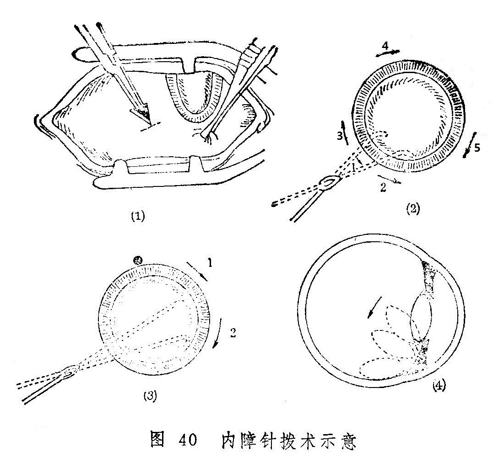

### 附一：如银内障针拨术

如银内障针拨术是在古代“金针拨内障”的基础上改良的一种手术方法，适应证为老年人患如银内障已熟或接近成熟者（即已发展为圆翳）。本法具有痛苦少，术后不须卧床和器械简单，操作简便等优点。老年多病患者尤宜这种手术方法。现介绍操作方法如下：

术前准备：术前数天患眼点消炎眼药水，冲洗泪道。术前2小时滴1%阿托品液或1〜2.5%新福林液散瞳，直至瞳孔充分散大（8毫米以上）。术眼按常规消毒，眼垫包封。进手术室后再冲洗及消毒皮肤，作表面麻醉。

手术器械：持针器、小蚊式止血钳、固定镊、双面刮胡须刀片（用时掰成三角形，刀锋长约7〜8毫米，底边宽约4〜5毫米）、拨障针、开睑器。

手术操作方法：以右眼为例，患者取平卧或半卧位，铺手术巾，作球后麻醉，放置开睑器（盲端在鼻侧）。术者右手持固定钱夹持风轮边缘6点处的白珠外膜，并牵拉眼球转向鼻上方，左手持止血钳夹紧掰成三角型的刀片，在距风轮边缘8〜9点钟的外侧4毫米处，与眼珠表面垂直，刀锋向外，作一垂直于风轮边缘，长约3毫米的切口〔图40（1）〕（切口要穿透眼珠外壳的全层）。

用拨障针从切口垂直穿入眼珠内3毫米深，再将针体转至与眼珠外壳接近平行，缓慢将针由黄仁后、晶珠前向瞳神正中推进，使针达晶珠前面。然后用拨障针按外下、外上、内上、内下等方向的顺序，将晶珠相应部位的韧带直接拉断，并问后方轻压〔图40（2）〕。继而以拨障针头弯曲部抱着晶珠对侧边际（右眼4点，左眼8点处）〔图40（3）〕拉压向颞下方，使之紧贴于眼珠外壳之内壁〔图40（4）〕。稍候片刻，徐徐起针至瞳神部位。如晶珠不再浮起，方可抽出拨障针。用小棉签轻轻揉按针口，使白珠外膜切口与白睛里层切口错位，达到用白珠外膜遮盖里层切口的目的。术后涂抗生素眼药膏及散瞳剂，术眼盖眼垫包封。

针拨术后处理：术后取头部稍高位平卧，或于第一、二天取30〜40度之半卧位。普食。大小便等日常生活均可自理。每天换药一次，4〜5天后解除眼垫。瞳神在未缩小到正常以前，不宜低头，以免神膏脱出黄仁之前。术后2个月可验光配镜。
