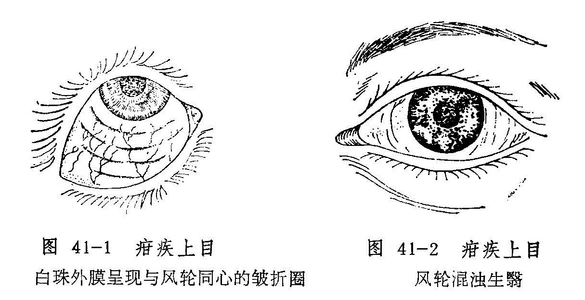

## 疳疾上目

疳疾上目，是继发于小儿疳积，以先发眼珠干燥，继则黑睛混浊不清，甚至糜烂破损为特征的眼病。本病名见于《中医眼科学讲义》（1964年），《秘传眼科龙木论》称之为“小儿疳眼”，《原机启微》称为“深疳为害之病”，俗称“疳毒眼”。如不及早治疗，常可导致失明。

〔病因病机〕

饮食不节，喂养不当，食有偏好等损伤脾胃，或久病虚羸，脾胃虚弱等，皆可导致脾失健运，气血生化不足，酿成疳积。脾病及肝，肝血虚少，目窍失养，或兼阴血不足，内生燥热，上攻于目，遂发本病。此外，无原则的忌口，或寄生虫病等消耗性疾病也可能继发本病。

〔辨证论治〕

（一）辨证要领

本病多双眼发病，初起眼部症状较轻，多见夜盲，眼珠干涩羞明，频频眨眼，继之白睛萎黄，眼珠转动时，白睛外膜可出现多个环绕黑睛的皱折圈（图41—1），日久则眼珠不转亦有此圈存在，呈“”状，最后则在睑裂部的白睛上出现顶端朝向两眦的三角形干燥斑，呈银灰色，不为神水润泽。黑睛亦失去光泽，枯晦混浊，呈毛玻璃样，甚则黑睛知觉丧失，呈灰白色胶冻样混浊，以至糜烂溃陷（图41—2），合并黄液上冲等症。愈后往往遗留翳障，影响视力。本病黑睛极易溃破，变生蟹睛、旋螺尖起、眼珠枯萎等恶候。

全身症状，初起常见面色萎黄，身体羸瘦，毛发枯焦，不喜抬头，并见挦眉、咬甲、揉鼻、烦躁不宁。后期腹大如膨，青筋暴露，频频泄泻，食欲全无，哭声嘶哑而低微，手足俱肿，则病属危重，除可双眼失明外，尚有生命危险。

疳疾上目多属虚损证候。临床遇之，除应对眼部表现仔细审察外，主要还应根据疳积的全身证候予以辨正。如仅见白睛干涩，频频眨目，面黄体瘦，食少腹胀者属肝脾亏虚；久泻引起的疳积，其疳毒上目者，多属脾虚挟湿；疳眼而泻，完谷不化，面色苍白，且兼肢厥脉微者，又为中焦虚寒；疳眼证见黑睛生翳或糜烂，午后潮热，烦躁不宁者，则属脾虚肝热。

（二）论治要点

本病的发生，主要是由于脏腑虚损，清阳不开，目窍失养，或兼肝经邪热上攻而致。所以补脾消疳、升举清阳、退翳明目是本病的主要治法，其中又以补脾消疳为治疗本病的关键。在补脾消疳的基础上，对兼有肝热者，应兼以清肝之法。疳疾若为虫积引起，又须先施杀虫消疳法，而后调理脾胃，升举清阳。

（三）常见证治

1.内治：

（1）肝脾亏虚：

证候：小儿食少腹胀，而黄肌瘦，白睛干涩，频频眨眼，或兼夜盲。

治法：健脾消积，养肝明目。

方例：八珍汤〔13〕、决明灵砂散血〔84〕。

（2）脾虚肝热：

证候：腹胀便溏，午后潮热，烦躁不宁，黑睛生翳或糜烂。此证或属虫积成疳，疳疾攻眼而致。

治法：健脾清肝或兼杀虫消疳。

方例：抑肝扶脾汤〔114〕。虫积导致者用肥儿丸〔147〕。

（3）脾虚挟湿：

证候：面黄体瘦，精神萎靡，食少腹胀，大便溏泻，黑睛生翳或糜烂破溃，舌淡苔白，脉濡。

治法：健脾益气消疳。

方例：参苓白术散〔150〕。

（4）中焦虚寒：

证候：面色苍白，大便频泄，完谷不化，肢厥脉微，黑睛糜烂或破损，形成蟹睛。

治法：温中散寒，补益脾胃。

方例：附子理中汤〔129〕。

如果在黑睛病变的同时，全身枯瘦，腹大筋青，便泄不止，口干声哑，手足浮肿，当以挽救生命为要，按儿科疳积之重危证论治。

2.外治：

（1）黑睛混浊糜烂或黄液上冲时，用清热解毒眼药水及扩瞳药滴眼。

（2）可用紫金膏〔238〕涂眼，以濡养眼珠，并有防轮穿破的作用。

3.针灸疗法：针刺四缝，灸气海、足三里、脾俞、肝俞、肾俞等。

（四）临证权变

疳疾的发生，或因积滞而损伤脾胃，或因脾胃虚损而食物停滞，每多兼有积滞之证，所以，对本病初起属于肝脾亏虚者，在应用决明灵砂散或八珍汤的同时，应酌加山楂、麦芽、神曲、鸡内金、陈皮等消积导滞药。或以消导为主治疗；初期过后，则须消补并行，最后以补脾健运以收功。如身体衰弱，必须以补益为主，稍佐消导之品，否则克伐太过，损伤元气，于病不利。参苓白术散所治证候为脾虚而水湿不运者，若兼见声音嘶哑，黑睛生翳，眵泪如糊，或如脓状，则为湿邪郁而化热，应加胡黄连以清热燥湿，或改用茯苓泻湿汤〔173〕治疗。

〔简便验方〕

1.鲜猪肝60克剖开，夹苍术末10克，以线扎定，入米汤内煮熟，然后将药肝连汤分次服用。每日一剂。年幼小者酌情减量。

2.捏脊疗法：以两手指背横压在长强穴部位，向大椎穴推进。同时以两手拇指与食指将皮肤肌肉捏起，交替向上，甚至大椎，作为一次，如此连续6次，在推捏第5、6次时，每次以拇指在腰部用隐力将肌肉提起约4〜5下，捏完后，再以两拇指从命门向肾俞左右推压2〜3下。此疗法有调理脾胃、调和阴阳、疏通经络的作用。

〔调护〕

1.患儿饮食应多进营养丰富的鱼、蛋、乳、肝类食品及新鲜疏菜，如胡萝卜、青菜等，以辅助治疗。

2.黑睛表面若已软化坏死者，应防止小儿用手揉擦眼部，医生也应避免重力开睑，以免促成眼珠穿孔。

〔应用例案〕

张XX，女，3岁，初诊于1953年1月15日。泄泻二日，津液大伤，不能营养周身，上达空窍，是以体尪形瘦，双目黑白两睛干燥，黑睛白晕如腐，相应黄液冲上，儿及瞳神，症询危笃，指纹淡红，舌苔淡白，病久脾虚，关门不固，气去阳衰，寒从中来，治宜温中。理中汤加茯苓、扁豆二剂（以后又连服二剂）。

三诊：泄泻好转，目微能张，盖其黄液减退，白障则仍留恋，病情根深蒂固，后果堪忧。原方加附子、山药，三剂。

四诊：利止，精神较旺，肤有华色，眼内干燥消失，黄液退去，惟白障化而未尽，斑脂翳成，幸瞳神微露，光线保留几分。身体消瘦，以后还当注意营养。五味异功散加杞子、七剂。（姚和清《眼科证治经验》）

〔文献摘录〕

《审视瑶函•疳伤》“疳症皆因饮食失节，饥饱失调，以致腹大面黄，重则伤命，轻则害目。患此勿治其目，竟治其疳，目病自愈。切忌油麺炙煿等物。

按小儿疳眼，无论肥瘦，但见白珠先带黄兼白色皱起，后微红生眵，怕亮不睁，上下眼睥频频劄动不定，黑珠上有白膜，成如此样圈，堆起白晕，晕内一黑一白，亦有肥瘦不同，疳眼无疑也。但肥疳大便如豆腐渣糟粕相似，瘦疳大便小如栗硬结燥，乃疳积入眼，攻致肝经，亦难治矣，小儿患疳眼声哑者，命将终也。”
