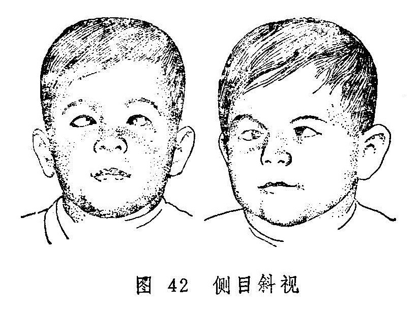

## 侧目斜视

侧目斜视是以眼珠突然偏斜，转动受限，视一为二为特征的眼病（图42）。病名见于《目科捷径》，《圣惠方》称为“眼偏视”，《圣济总录》则称“目偏视”。《中医眼科学讲义》（1964年版）称本病为“风牵偏视”，其实本病的病因病机比较复杂，非独风邪所牵，所以本书不用该名。古医籍中，对突然偏斜且程度较甚者，称为“神珠将反”（《证治准绳》）；黑睛几乎不可见，仅见白睛者又称“瞳神反背”（《证治准绳》）；眼珠向下偏斜，转动不灵者别称“坠睛”（《圣济总录》）；眼珠向上偏斜者，又称“目仰视”（《审视瑶函》）；如小儿双眼目珠偏斜于内眦侧者称为“小儿通睛”（《秘传眼科龙木论》）。其实均属侧目斜视的范畴。若伴见口眼歪斜者，称为“口眼㖞斜”，与单纯的侧目斜视是不同的（见后）。

侧目斜视常伴视一为二症，需与视惑证的视一为二症相鉴别：侧目斜视有明显的眼珠偏斜，不得诊为视一为二；视惑证的视一为二症则外眼端好，唯一眼或双眼视一物为二形，且常伴视物不真，视大为小，视正反斜，视直为曲等症。其视一为二若单独出现，可诊为“视惑”，亦可迳诊为“视一为二”。

〔病因病机〕

1.正气不足，卫外失固，或阴血亏少，脉络空虚，风邪乘虚入中。

2.脾虚失运，聚湿生痰，复感风邪，风痰阻络。

3.肝肾阴亏，阳亢动风，挟痰上扰，阻滞经络。

4.中风后遗，气虚血滞，脉络瘀阻。

上述诸种因素皆可导致眼部受邪，一侧经络的气血运行不利，使该侧眼带失养而弛缓不用，健侧眼带舒缩功能正常而反似拘急，牵引眼珠偏向健侧。

〔辨证论治〕

（一）辨证要领

本证猝然发作，表现为单眼或双眼黑睛偏斜于眦侧，转动受限，视一为二，或伴上胞下垂，目闭难睁之症。本病虽常由风邪乘虚入中经络而发，但内风引动者亦不少见，且常与痰阻、气滞、血瘀相关。由风邪侵袭经络而发者，常伴有恶寒、发热等卫表症状；如兼肝血不足，则可伴有面色无华，头晕耳鸣等血虚征象。除眼部症状外，若患者平素食少便溏，泛吐痰涎，舌苔厚腻，脉沉弦或弦滑等，则属脾虚湿盛，复受风邪，风痰阻络而致。若素有头晕耳鸣，腰膝痠软等肝肾阴虚之证，黑睛突然偏斜不动，且伴舌红苔黄，脉弦细或弦滑者，则为阴虚阳亢而化风，挟痰上扰而致；若为中风后遗症的目珠偏视多属气虚血滞而然。

（二）论治要点

本病以卫外不固、肝血不足、以致风邪中络，及脾虚湿盛、风痰阻络最为多见。治疗当以祛除风邪为主要治法。并在祛风之同时必须注意扶正，或兼补气，或兼养血，挟痰者又须配以化痰药。

临床治疗本病还须分清内风与外风。属外风者，可选用疏风药疏散风邪；属内风者，则当以调理脏腑气血为主，选加僵蚕、全虫、白附子、胆星等祛风通络之品。

（三）常见证治

1.内治：

（1）卫外失固，风邪中络：

证候：黑睛猝然偏斜，转动受限，视一为二，伴有恶寒发热，头痛，舌质淡红，苔薄白，脉浮等表证。

治法：疏风通络，扶正祛邪。

方例：小续命汤〔27〕。

（2）肝血不足，风中脉络：

证候：眼部症状具备，具有面色无华，头晕耳鸣，舌淡脉细，起病之初尚有恶寒发热等表证。

治法：养血祛风。

方例：养血当归地黄汤〔155〕。

（3）脾虚湿盛，风痰阻络

证候：眼证同前，素有纳呆食少，泛吐痰涎，或有便溏，舌苔厚腻，脉弦滑。

治法：健脾化痰，祛风通络。

方例：六君子汤〔32〕合正容汤〔52〕。

（4）肝阳化风，挟痰上扰：

证候：素有头晕耳鸣，失眠多梦，腰膝痠软等症，黑睛突然偏斜不动，舌红苔黄，脉细弦或弦滑。

治法：平肝潜阳，化痰熄风。

方例：天麻钩藤饮〔38〕加胆星、僵蚕、全蝎、贝母之类。

（5）气虚血滞、络脉瘀阻：

证候：有中风病史，后遗目珠偏视，口眼㖞斜，半身不遂，或肢体麻木不仁，面色萎黄，舌质淡或有瘀斑，苔白，脉细。

治法：益气活血，化瘀通络。

方例：补阳还五汤〔104〕。

2.针刺疗法：选用睛明、瞳子髎、承泣、四白、阳白、丝竹空、太阳、攒竹、颊车、地仓、合谷、太冲、行间、风池等穴。每次局部取2〜3穴，远端循经取1〜2穴。向左斜者刺右，向右斜者刺左。

（四）临床权变

本病由卫外失固、风邪中络而致者，若系风寒可用小续命汤〔27〕原方，或与牵正散〔169〕合用。若系风热为患当去方中之姜、桂、附，酌加生石膏、秦艽、桑枝、薄荷之类，以辛凉疏风，清热通络。侧目斜视兼见恶心、呕吐，步履不稳，头昏不适，舌淡脉浮等风痰阻络之象，而脾虚之证不明显者，可单用正容汤，或加川芎、赤芍、地龙以祛风除痰、通利脉络，不必合用六君子汤；本病亦可继发于热病后期，多属阴津耗伤而兼风痰阻滞，常伴口干欲饮，咽干唇红，舌红少苔，脉细数等症，可选用沙参麦冬饮〔101〕加秦艽、僵蚕、贝母、胆南星、丝瓜络养阴祛风、化痰通络；头部或眼部外伤，亦可致气血瘀滞，眼带失灵而偏视，治宜行气活血，化瘀通络，可用桃红四物汤〔185〕加减治之。

〔应用例案〕

石XX，女，55岁。于1969年8月13日来诊。主诉15天前，因左边偏头痛引起左眼上睑下垂，睛珠外斜，双眼视物复视，曾在XX医院检查，诊断为动眼神经不全麻痹，现在头痛剧，口不干，胃纳尚可，二便正常。素有高血压病。

检查：右视力1.0，左0.7，左眼上睑下垂，用力睁眼仅离小缝，眼珠外斜，内转明显受限，脉沉细。

诊断：左眼目偏视、睑废证。

据脉证，脉虽沉细，但头痛剧，属风邪较重，在治则上应舍脉从证，法当健脾散风，疏通脉络。用羌活胜风汤加减（羌活、银柴胡、黄芩、白术、枳壳、防风、前胡、薄荷、全蝎、桔梗、勾藤、甘草），服六剂，并配合针刺疗法，头痛大减，上睑下垂及睛珠外斜显著好转。但头晕心悸，腿胀乏力，又接上方加生牡蛎9克，夏枯草15克，牛膝9克，远志9克，炒枣仁9克，服七剂，头痛头晕均愈，眼睑睁合如常，眼珠转动自如，复视完全消失。至此，嘱其依上方再服，以善其后。愈后观察两个月，情况良好。（《中医眼科临床实践》）

按：本例目偏视属风邪阻络，故拟疏风通络之法治之，佐以健脾。羌活胜风汤加全蝎、钩藤，与小续命汤之方义相似。
