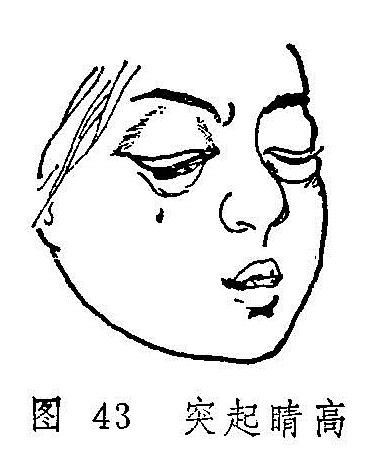

## 突起睛高

突起睛高是以睛珠胀痛、突起、甚至高突出眼眶为特征的急性眼病（图43）。病名见于《秘传眼科龙木论》，又名“睛高突起”、“目珠子突出”等。

〔病因病机〕

1.外受风热火毒，上攻于目。

2.肝气郁而生热，夹杂风痰热毒，上攻目珠。

〔辨证论治〕

（一）辨证要领

起病急速，眼痛难忍，泪热常流，视力下降或骤降，胞睑、白睛均红赤肿胀，可兼眼珠或眶内蓄脓，睛高突起，甚至可高突出眶，转动失灵，最终可溃穿出脓。脓蓄珠内者，可致珠塌目盲。常伴发热头痛，恶心呕吐，甚至高热昏迷，病情危重。本病的辨证当分邪毒初起和邪毒炽盛：邪毒初起，除眼症状外，每伴发热恶寒，头痛眼胀，舌尖红，苔薄黄，脉浮数等症。若眼珠或眶内蓄脓，头痛剧烈，或伴发热而不恶寒，烦渴多饮，溲赤便秘等，为火毒炽盛；万一出现头痛项强，神昏，面赤气粗，舌质红绛等症，又为邪毒内陷心包之证。

（二）论治要点

本病的主要病机为风热火毒壅滞，所以清热解毒，活血消肿为治疗本病的关键。邪毒入内，兼大便秘结者应兼以泻下，以收釜底抽薪之效。

（三）常见证治

1.内治：

（1）风热火毒初起：

证候：病情初起，眼珠疼痛突起，胞睑红肿，泪出汪汪白睛红赤壅肿，兼见发热恶寒，舌红苔黄，脉数或浮数。

治法：清热解毒，活血消肿。

方例：仙方活命饮〔74〕。

（2）火毒内陷心包：

证候：前述症状更剧，头眼剧痛，恶心呕吐，壮热神昏，面赤气粗，小便黄赤，舌质红绛、脉数。

治法：清营解毒、清心开窍。

方例：清营汤〔199〕，或送服安宫牛黄丸〔85〕。

2.外治：

（1）可用葱、艾捣烂炒热以温熨。

（2）可用白芷、细辛、当归、苍术、麻黄、防风、羌活煎汤熏洗。

3.手术：有脓者，及时以刀、针排脓放毒。

（四）临证权变

本病多为急性发作，并以红赤剧痛、目珠突出为主要特征，所以前述方药最为常用。若系病情日久，肿硬不消，疼痛不甚，苔滑脉缓，可按痰湿结聚，治宜化痰散结，方用消瘰丸〔175〕加昆布、海藻内服。兼有郁热者，更加竹茹、夏枯草、炒山栀清热化痰散结。

〔调护〕

勿食肥甘、辛辣之品，饮食清淡。注意休息。

〔文献摘录〕

《秘传眼科龙木论•突起眼高外障》此眼初患时，皆因疼痛发歇作时，盖是五脏毒风所致，令睛突出。此疾不宜针灸钩割。……若要平稳，用针针破，流出清汁，即得平复。
