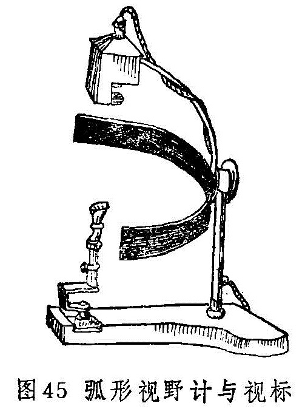
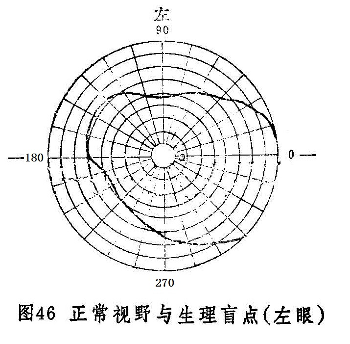
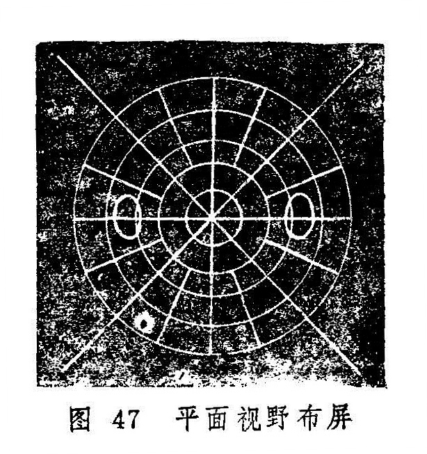

### 三、视野检查法

视野检查即周边视力检查，是对黄斑中心窝以外视网膜的视力检查。当眼球平直向前注视一固定点时，其所察觉到的全部空间范围，视为视野。视野检查对内障眼病的诊断有重要的参考价值。

（1）对比法

医生与被检查者距离1米，相对而坐，双方的眼睛应在同一水平高度。如检查右眼，则遮盖被检者的左眼和医生的右眼，让被检者的右眼与医生的左眼相互注视，然后医生举起摇晃的手指，在两人之间于各个方位分别自外向内移动，至被检者能察觉手指的出现时，比较被检者视野与医生正常视野的差别。另一眼的检查方法相同。此法简便，有一定的可靠性，但不够精确，且无法作记录以供查考（图44）。

（2）视野计检查法

①弧形视野计检查：弧形视野计（图45）主要构造为一宽75厘米的半圆弧形金属板，底面为无光黑色或灰黑色，半径为33厘米，中央固定，可以旋转，弧的中央为零度。两端为90度。检查时令被检者的下颔放在支架上，遮盖一眼，使受检眼与零度在同一水平线上，并注视中央固定点不动，然后医生将视标沿弧板内面，由周边慢慢向中央移动。当被检者发现视标时，记下弧板外面的刻度。旋转弧板，至少在八个不同子午线作同样检查。并将所记录的各点用笔连接起来，即得出该眼的视野范围。

视野的大小，可因视标的大小与颜色，检查的距离，光线的强弱，背景的不同以及被检查鼻梁的高低，瞳孔和睑裂的大小及其精神与健康状况而有所改变。通常用3毫米直径的视标。若视力很差，则可改用直径为5或10毫米的。检查时只用白色视标有时不够，常须用有色视标作为补充。如视网膜疾病用蓝色或黄色，视神经疾病用红色或绿色等。

正常视野（白色）的平面范围，其颞侧为90度，鼻侧为60度，下侧为70度，上侧55度。（图46）因视网膜的黄斑部对颜色的感觉最为敏锐，而向周边逐渐减弱，所以各种颜色视野较白色为小。由外而内，为白、黄、蓝、红、绿，依次递减10度左右。

②平面视野计检查：主要检查围绕固视点，30度以内视野范围的暗点。平面视野计（图47）是用一块1平方米黑色不反光的布做成的布屏。以布屏的中心为圆心，按视角每5度划一同心圆，并在两侧15度之水平线下1.5度处标出其生理盲点的范围。检查时，被检者坐在布屏前1米处，遮盖一眼，受检眼在屏中央的注视点正前方，并注视不动。然后检查者持视标由周边向中央在各子午线上缓慢移动，检查出来的暗点范围先用小黑针头标记，最后描记在记录上。在此视野范围内，除生理盲点外所出现的任何暗点，皆为病理性暗点。

