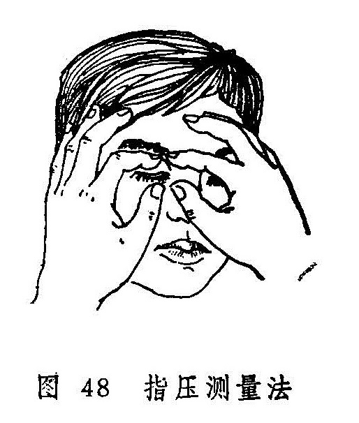
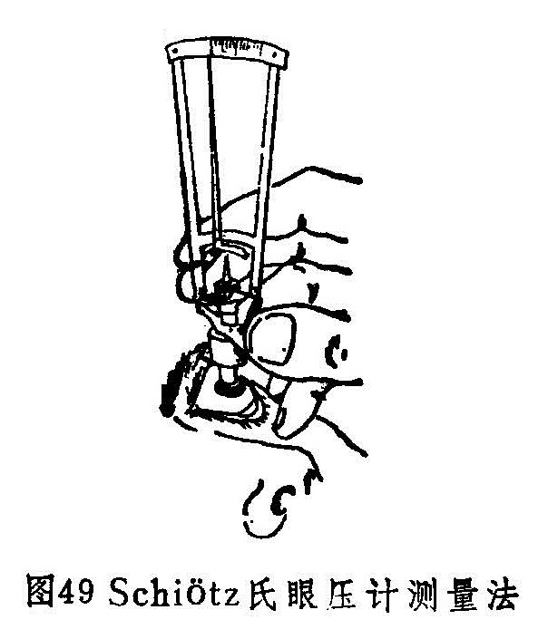

### 五、眼压检查法

眼球内容物对眼球壁所施的压力，叫眼内压。眼压是眼内压的简称。常用的眼压检查法有指压法与眼压计测量法两种。

（1）指压法：令被检者双眼自然向下注视，医生用双手的中指、无名指和小指固定于被检者的额部，然后以双手的食指尖放在被检眼的上睑中央，隔着上睑，轻轻交替触压眼球（图48），凭借指尖触知的抵抗力，估计眼压的高低。通常用“T”代表眼压，如眼压正常，记录为“T~n~”；若偏高，则根据其程度不同分别记录为“T~n+1~”、“T~n+2~”、“T~n+3~”；若偏低，则分别记录为“T~n-1~”、“T~n-2~”、“T~n-3~”。

指测眼压，虽然比较粗糙，但方法简便，通过不断实践，有了一定的体验后，也可对眼压的高低作出一个比较正确的估计，故常为眼科医生所喜用。

（2）眼压计测量法：目前国内最常用的为压陷式的修兹氏眼压计（图49），测定时以砝码（有5.5克、7.5克、10克、15克四种）重量及压陷深度来推算眼压的高低。测量前先用0.5〜1%地卡因液滴眼两次作表面麻醉，将眼压计竖立在小圆板上试一下，指针恰恰指向零度是为准确，否则要加以调整，并将眼压计底盘用75%酒精擦洗消毒，待干备用。嘱被检者低枕平卧床上，双眼自然睁开，注视上方目标，使双眼角膜保持在水平正中位置，医生用左手拇指与食指轻轻分开上下眼睑，并固定在上下眶缘上，以免压迫眼球。用右手持眼压计把手并竖直，在没有任何一压力的情况下，将眼压计底盘轻轻放在角膜中央，迅速观察眼压计指针所指的刻度。如读数小于3，则更换较重的砝码，重新测量。用分数式记录所用的砝码重量与测得的读数，再查换算表，即得出眼压的实际毫米汞柱数，如5.5/5=17.30毫米汞柱，测量完毕后，用抗生素溶液滴眼。眼压越高，所需砝码的重量越大。我国人正常眼压为10〜21毫米汞柱。眼压在24小时内可稍有波动，但正常的波动幅度一般不超过5毫米。

