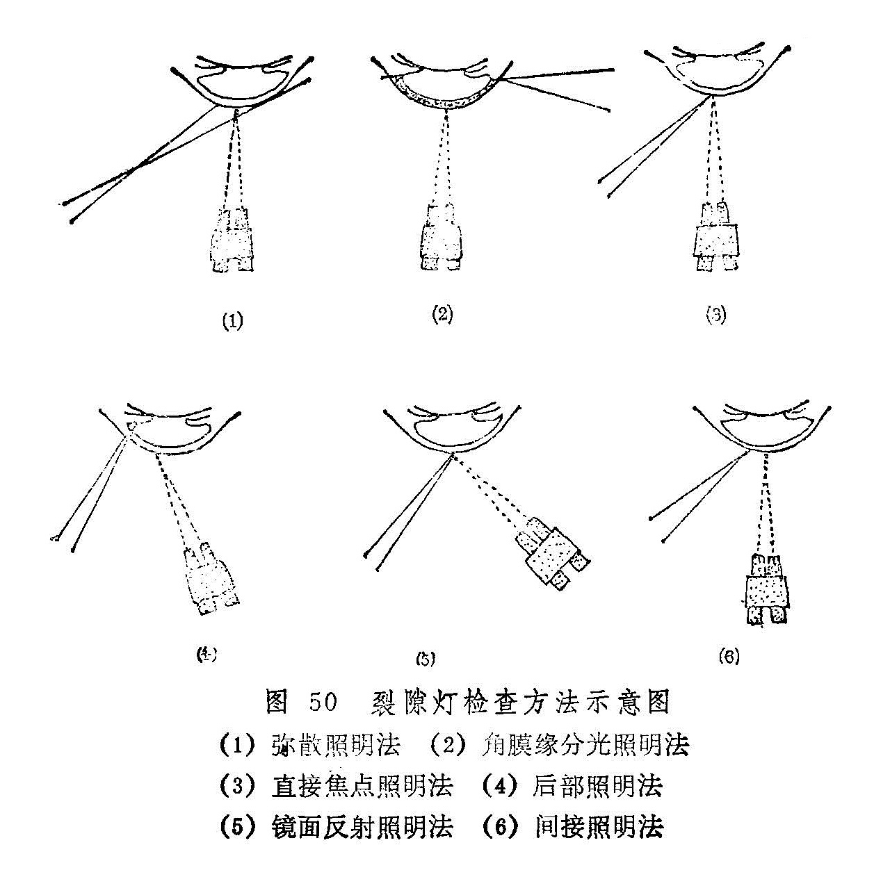
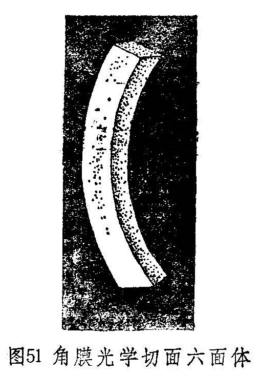
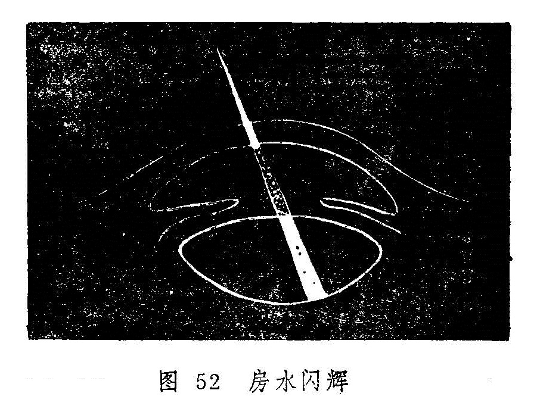
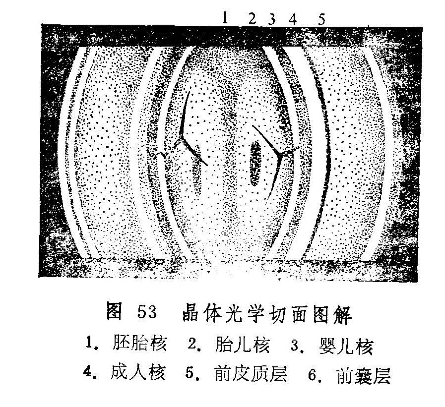

### 六、裂隙灯显微镜检查法

裂隙灯显微镜由两大系统组成，即光源投射系统和光学放大系统。裂隙灯显微镜不仅能使表浅的病变观察得十分清楚，而且可以调节焦点和光源的宽窄，作成“光学切面”，使深部组织的病变也能清楚地显示出来。还可附加前置镜、接触镜及三面镜等，配合检查视网膜周边部、前房角及后部玻璃体等。因此裂隙灯显微镜在眼科临床上的应用很广泛。

裂隙灯显微镜检查在暗室内进行，一般先用低倍显微镜，所看到的物象清晰而视野大；倍数加高，物象增大但视野较小。常用检查方法有6种。

1.弥散照明法：光源从较大角度斜向投射，同时将光源的裂隙充分开大，广泛照射〔图50（1）〕。检查结膜、角膜、巩膜等眼前部组织均可用此法，但这只是初步而粗略的检查，不能作细致的观察。

2.直接焦点照明法：即灯光焦点与显微镜焦点联合对在一起，是最常用照明法〔图50（3）〕。当强光投射到眼组织上时，由于眼组织透明度不同，光线呈反射、折射或散射。如光线投射到巩膜及虹膜上时，大部分光线被反射散射或吸收，故只见一境界清楚的照亮区。这样可以细致地观察该区的病变。裂隙照在透明的角膜和晶体上，则呈现一种乳白色的光学切面。角膜光学切面为透明六面体（图51），借此可以观察其弯曲度及厚度、有无异物及角膜后沉着物，以及浸润、溃疡等病变的层次和形态。将裂隙调成细小光柱射入前房，详查房水是否清晰，有无混浊物。当虹膜睫状体炎时，有蛋白质和细胞渗入前房，则房水混浊，可见房水闪辉阳性（图52），并可看到白细胞等的浮游（房水靠近虹膜处温度高则上升，靠近角膜则温度较低而下降，形成热对流现象，白细胞随热对流而浮游）。将焦点由瞳孔区后移，并作成窄裂隙光投射，晶体也出现一光学切面（图53）可将焦点先从晶体前囊，渐渐向后移到后囊，这样就可逐一看清晶体的各层情况。如看到晶体有混浊，应仔细观察其部位、形态，以便分析是先天性还是老年性白内障。如果后囊和后皮质混浊，色棕黄，形似锅底状，应考虑为并发性白内障。焦点再向后移则至玻璃体，此种照明方法检查，只能看到玻璃体前1/3。正常玻璃体前面在光束中，呈细纤条或纱膜状结构，形似悬挂的纱幕皱褶，随眼球运动而飘动。

 

3.后部照明法：此法灯光的焦点与显微镜的焦点不在一个平面上，而是把灯光照在被检查目标的后方。此法又分为直接后照法及间接后照法。直接后照法是显微镜焦点位于反射光路中；而间接后照法是显微镜焦点不在反射光路中〔图50（4）〕，如检查角膜后沉着物，将灯光照射在虹膜上，由虹膜上反射的光线，从沉着物背后照射过来，显微镜观察的方向恰在反射光路里，以虹膜作背影，则为直接后照法；显微镜观察的方向若不在反射光路中。而以瞳孔为背景，则为间接后照法。后部照明可发现角膜上皮或内皮水肿、角膜后沉着物、新生血管，轻微瘢痕以及晶体空泡等。

4.镜面反射照明法：角膜及晶体的前后面表面十分光滑，当光束射在各个表面时，均能形成规则的反射。显微镜在规则反射的光路上，看到的光反射称镜面反射〔图50（5）〕。如在某一表面上有不光滑部分，则该处称不规则反射，因此镜面反射照明法，可以仔细观察角膜前后面及晶体前后囊膜的细微变化。观察角膜内皮及后弹力层多用此法。

5.角膜缘分光照明法（角膜缘散射照明法）：将裂隙灯光照在角膜缘上，利用角膜的透明性，光线在角膜内部全反射，使角膜缘其它部位出现明亮环形晕，尤其对侧特别清楚〔图50（2）〕。此时显微镜焦点对准角膜，如角膜有任何混浊，如薄翳、水泡、沉着物、血管、穿孔、伤痕等均可清楚地看出。

6.间接照明法：将灯光焦点放在检查目标的附近，再用显微镜观察目标。通过光线在组织内部的分散与屈折，使之照明，可观察附近组织病变，此法又常与后照法合并应用〔图50（6））。

用裂隙灯显微镜检查眼底时，需在被检眼前加一58.6屈光度的平凹透镜（接触镜或前置镜），便能观察到后2/3玻璃体及后极部眼底。如瞳孔充分散大，角膜上加戴三面镜，则更能看到赤道部及周边眼底。因双目观察更可产生立体感，用以确定某些检眼镜检查不易分辨的病变。
