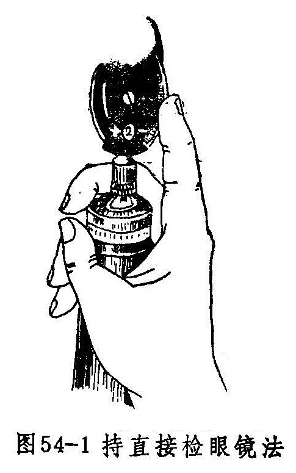
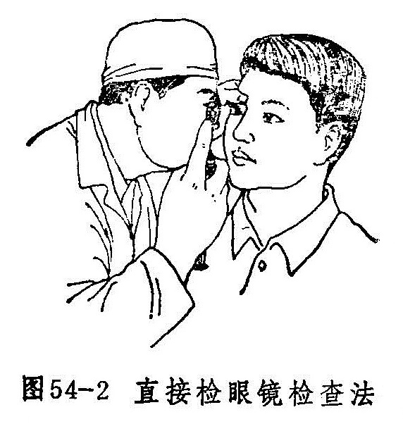
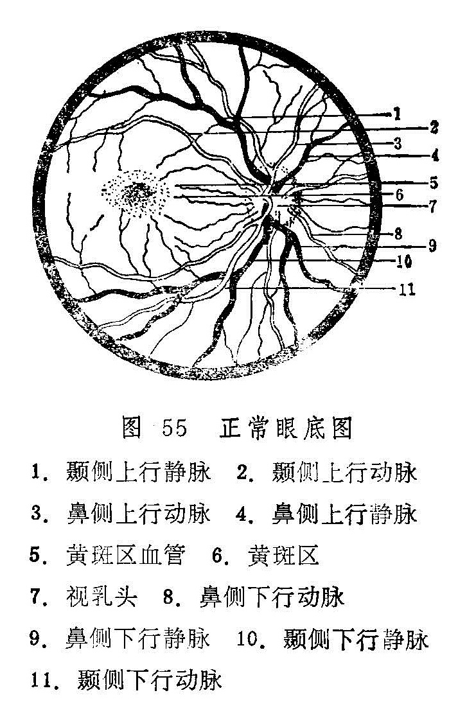

### 七、内眼检查法

内眼检查须用检眼镜在暗室内进行。一般在瞳神正常大小情况下检查，必要时在排除绿风内障后，用1%新福林扩瞳，作比较详细的检查。

首先利用检眼镜检查一下屈光间质是否混浊，医生先将直接检眼镜的轮盘转到+8〜+12屈光度处（图54-1）。令被检者双眼直视远方，然后将检眼镜放在距被检眼20至30厘米处，使光线射到被检眼的瞳孔区，检查者从检眼镜小孔窥视各透明体情况。正常瞳孔区呈弥漫性桔红色反光。如该区出现点状、线状或团状黑影时，嘱被检者向各个方向转动眼球后向前方注视，若混浊随眼珠移动，则混浊在黑睛或晶珠上；若眼珠停止转动后，混浊仍在浮动，则表示混浊在玻璃体内。

接着将检眼镜转到“0”屈光度，准备检查眼底各部。若检查右眼，医生应站在病人右侧，用右手持检眼镜，以右眼观察；检查左眼时，则要站在左侧，用左手持镜，用左眼观察（图54-2）。同时将检眼镜移至被检眼前约2至3厘米处。若被检眼或医生有屈光不正，应调整轮盘度数至能看清视神经乳头形态为止。

      

眼底检查顺序及注意点：

1.视神经乳头：正常视神经乳头呈圆形或稍呈椭圆形，直径约1.5毫米，边缘清楚，颜色淡红。中央偏颞侧颜色较浅而稍凹陷。凹陷之大小各人虽不一致，但绝不能达到视神经乳头边缘。生理凹陷底部，隐约可见一些暗灰色小点，该处即为筛板。视网膜中央血管由视神经乳头中央进入眼底，视神经乳头上的静脉有时可见搏动。

检查时，注意视神经乳头的大小、形态，边缘是否清楚，颜色是否变红或褪色；有无水肿、出血、渗出；生理凹陷有无扩大、加深；视神经乳头上的血管是否偏鼻侧，以及有无屈膝样改变，动脉有无搏动；有无新生血管或赘生物。

2.视网膜中央血管：视网膜中央血管进入眼底分为颞上、颞下、鼻上、鼻下四支，然后又分为很多小支，支配视网膜各部。动脉色鲜红较细，静脉色暗红而较粗，正常时动脉与静脉第1、2分支的管径之比约为2：3。通过血管壁可以看到血柱。

检查时，注意血管的粗细及其弯曲度，动静脉管径的比例，血管壁反光情况，动静脉有无交叉压迫征，有无白鞘伴行，有无血管闭塞及侧枝循环等。

3.黄斑区：位于视网膜后极，视神经乳头的颞侧略偏下方，距视神经乳头约3〜4毫米，范围略大于一个视乳头大小，颜色较其它部视网膜为深，无血管，其中央可见一针头大反光点，为中心窝光反射。

检查时，注意黄斑区中心光反射是否存在，黄斑区有无水肿、出血、渗出物、色素紊乱，萎缩斑或裂孔等。

4.视网膜：正常感觉部视网膜是透明的，因脉络膜及色素上皮层的关系，使眼底呈均匀的桔红色。也有因脉络膜色素较多并充实于血管之间，使红色脉络膜血管透露出来呈豹纹状眼底的。

检查时，应沿血管分布区域进行。注意眼底视网膜有无水肿、渗出、出血、萎缩斑、新生血管或色素沉着，有无肿物、视网膜脱离或裂孔等。

眼底检查结果须绘成简图并作记录（正常眼底象见图55）。描述眼底病变时，通常以视神经乳头、视网膜血管、黄斑部为标志，注明病变的位置，如颞上、颞下、鼻上、鼻下，距离视神经乳头边缘有多少个视神经乳头直径等。病变的大小，也以若干视神经乳头直径表示。病灶如有隆起或凹陷，则以若干屈光度表示。每3屈光度约相当于1毫米。

