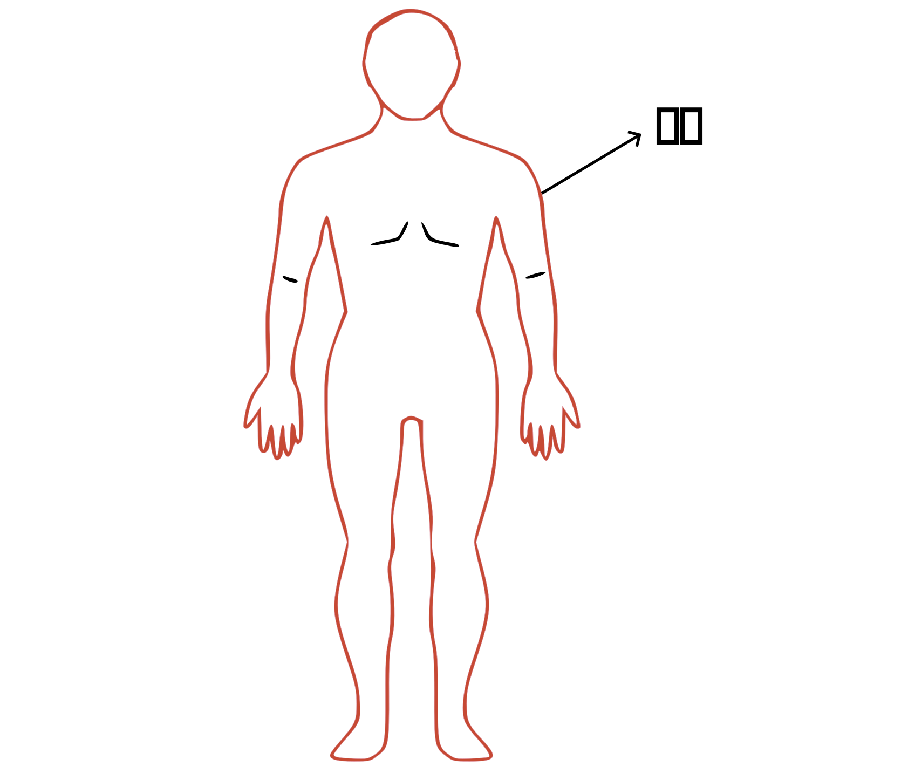

# 二、察皮肤

## 皮肤温度

正常：正常体温

### 异常

#### 温度高低

温度高于正常还是低于正常？

#### 势头快慢

发病急，热势高？发病缓慢，热势不高

#### 温度高的程度

壮热：即大热、盛热，手按病人肌肤而有烫手的感觉，且久按热感不减，多兼见口渴面赤气粗等称为壮热。

低热：热的程度不高

#### 日夜变化

夜间热的厉害，白天减轻或者消失？或者白天热，晚上减轻？

潮热：每天在固定时间段发热一次，像潮水一样有规律，过了时间就减轻或消失。发作时间有的下午，有的在夜晚，有的在清晨。

#### 部位

全身热还是局部热？

五心发热：指手足心及心胸中烦热。

#### 触摸感受：

初按皮肤热重，久按则热转轻的；

若久按其热更甚，热从内向外蒸发；

手心热，或肌肤热而无蒸腾之感。

## 对环境的喜恶

正常：健康人对环境的寒热风湿燥有正常的调节能力，不会有明显异常的偏颇喜好。

异常：

怕冷、怕风、怕热、怕湿、怕燥

## 皮肤颜色：

异常：

黄、黑、白、红

鲜明、晦暗

颜色深？颜色浅？

## 皮肤润泽度

正常：

皮肤滑润

异常：

过于潮润

干燥

枯燥

肌肤甲错:皮肤上抚之如树皮，粗糙刺手

皮屑:皮肤脱落鳞屑

## 皮毛

毛焦:毛焦和毛折

## 皮肤肿

手按之肌肤不能即起，凹陷成坑的，是水肿；

按之举手而起的，是气肿。

## 皮肤质地

### 常态：

光滑柔软

### 常变：

皮肤也具有排毒功能。如果人体有热毒需要外排，皮肤通道就是外出通道之一。此时可能在皮肤上表现出斑疹现象。这种排毒过程，如果顺利，可能会自愈，称为顺证。如果不顺利，称为逆证。

> 麻疹是时邪疫毒所致的儿科常见的发热出疹性传染病。...本病在整个发展过程中，一般可分为“疹前期”、“出疹期”、“收疹期”三个阶段，在病程中，如护理得当，可勿药自愈。
>
> 《中医儿科学-麻疹》

### 异常

#### 斑疹：

斑，为成片，或红或紫，平布于皮里，摸之不碍手。

疹，呈红点，小如粟粒，高出皮肤，摸之碍手（少数并不高出皮肤，摸之也不碍手）。

斑疹色泽：

顺证：红活润泽

异常：

颜色异常：

深红如鸡冠色

紫暗

淡红或淡紫

斑疹形态：

顺证：分布均匀，疏密适中

异常：

稀疏松浮

稠密紧束，压之色不退

疏密不匀，或见而即失

斑片较大

时有时无

#### 白㾦

白㾦是一种大如栗粒，高出皮肤，透明的小泡疹。多出现于颈项及胸部，偶见于四肢，惟不见于面部。

正常：晶莹饱满

异常：枯白无泽，浆水不饱满

#### 痈疽疔疖

痈：范围较大，红肿热痛，根盘明显者为痈。

疽：漫肿无头，部位较深，常不高出皮肤，局部肤色不变者为疽。

疔：发病范围小，初起如粟粒大小，根脚坚硬，或麻或木或痒，顶部白色而痛者为疔。

疖：发于浅表，形圆，红肿热痛，化脓即软，为疖。

## 汗

### 原理

汗是人的一种生理机能。肌表部位的热量较多时，会逼迫津液从汗孔排出，成为汗。中医称之为“阳加于阴，谓之汗”。

正常的出汗，一般是出于排邪的需要，比如肌表有过多的热量，或者肌表有风寒等邪气的时候，人会自主出汗排邪。

正常出汗需要包括几个条件：

1、肌表的热量过剩

2、肌表的阴液充足

3、汗孔正常开合

### 常态

一般情况下，人是不出汗的。

### 常变

当肌表热量增加，或者有其他排邪需求的时候，会正常自主出汗排邪。（热量过多可以理解为热邪）。邪气排出后，汗会自然停止。

情况举例：

天气炎热需出汗

运动、劳动、喝热饮、穿厚衣等情况，体内热量过多，需出汗。

肌表受风寒之邪，人体会自主出汗排邪。邪气随汗排出后，汗自动停止。

人体内部热邪较多，向外散发到肌表，肌表通过出汗的方式散热。

### 异常

未按照上述常态和常变发展的情况，皆为异常。

#### 出汗的时机

##### 自汗

不正常的出汗统称为自汗。包括无天气热、无运动劳动、未喝热饮、未穿厚衣服情况下，却自己出汗；也包括肌表有邪气时，虽出汗，却未能排邪等情况。

##### 无汗

该出汗的时候不出汗，称为无汗。肌表发热温度较高时，本应出汗却不出，既属于无汗。

#### 出汗部位

通常出汗应该是全身出汗。如果只在某些局部出汗时需要注意。

头汗：全身只是头面部出汗，其他部位不出汗。

半身汗：只有半身出汗，另外半身不出汗。出汗的半身可能是左半身、右半身、上半身或者下半身。

心胸汗：只在心胸部位出汗。

手足心汗：手足心出汗。要注意量多还是量少。量少一般不是病态。量多需要关注。

#### 汗的温度

因大多时候汗是排热的，所以正常出汗应该是热汗。如果汗的温度是凉的，称为冷汗。

#### 汗的颜色

正常汗是无色的。如果颜色发黄，为黄汗。

#### 汗的质地

正常汗是清稀的。如果质地发黏，汗出如油，称为粘手汗。

#### 其它类型

盗汗：盗汗是指在睡梦中出汗，醒来后，汗就停止了，所以又称“寝汗”。

大汗：出汗量大，明显超过普通出汗的量。

战汗：战慄之后而汗出

