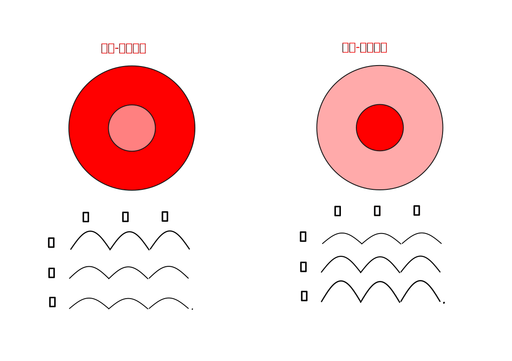
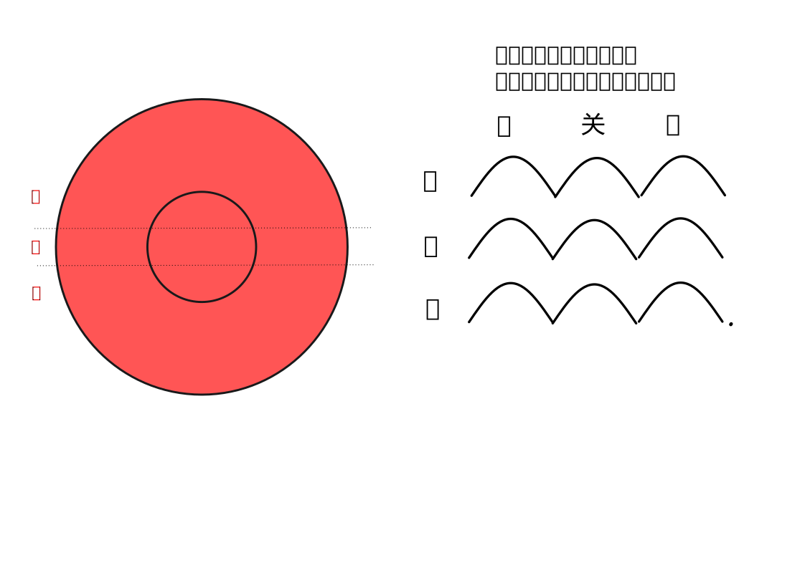

# 五、察四肢

### 察寸口脉

#### 取脉方法

##### 部位

掌后高骨侧，触之有脉跳动处。

以高骨处为关，关前为寸，关后为尺。

左右两手共六个部位

如图：

##### 时间

诊脉的时间，一般选择在清晨日出，未进饮食之时，此时气血在全身的分配最平均。夜晚气血偏于里，白天气血偏于表，饮食后气血偏于脾胃，不同情况下气血各有所偏。

##### 按压力度

诊脉的力度分轻、中、重三种。

轻按皮肤为浮取，又称为举；

中等力度按至肌肉为中取，又称为寻；

重按至筋骨为沉取，又称为按。

##### 小结

寸口脉有寸关尺三部，每一种力度为一候，所以每一部都有浮、中、沉三候，共称为三部九候。

#### 关注指标

每一侯的脉象皆需收集以下指标：柔和度、力度、频率、宽度、长度、流动情况、起伏情况。

> 第一，要注意脉位、脉数、脉形、脉势。周学海说：“须将位、数、形、势四字讲得真切，便于百脉无所不赅，不必立二十八脉之名也。”一般先定位，以分浮、沉；次数息，以别迟、数；再辨形，以定大、小、长、短；最后审势，以辨虚、实、滑、涩等。关于审势，须识上下来去至止，凝神于指下起、伏、去、来、头、末之势，借以判断病证的升、降、敛、散。
>
> 《临证程序-不重视脉诊》

##### 柔和：

脉应该有柔和感，不能过于坚硬。脉有柔和的感觉，称为有胃气。脉如果不柔和

##### 力度：

脉应有一定力度，力度应适中。过于有力，称为脉实、脉强。偏于无力，称为脉虚、脉弱。过于无力为脉微。

##### 频率：

频率一息四至-五至都为正常，也就是一分钟60次到90次。超过六次，就是一分钟超过90次，称为脉数；小于三次，就是一分钟低于60次，称为脉迟。

注意这里的一息指的是健康医者的一呼一吸周期，因为医者号脉时是以自己的呼吸来计算时间的。

脉的频率应该均匀，也就是不能忽快忽慢，或者跳动几次就停一段时间。

如果出现跳动几次就停一段时间的情况，要看停歇的时间是否固定。

如果停歇的时间不定，一会儿停的时间短，一会儿停的时间长，就是“**止无定数**”，称为促脉、结脉。其中如果脉跳的很快，称为促；跳的很慢称为结。

如果停歇的时间固定，称为“**止有定数**”，也就是其跳动与停歇有规律，比如总是跳三次停一次，或者总是跳五次停两次等等，则称为代脉。

频率极快，一息七至以上，称为疾脉。

##### 宽度：

脉的宽度体现的是血管中血的充盈程度，正常情况下应为不宽不窄。过宽代表血管中的血偏多，称为脉大。过窄代表血管中的血不足，称为脉小，或者脉细。

##### 脉之来去

当脉搏从心脏来到手腕部位时，因为是从心脏来到手腕，所以称为脉来。此时脉搏向上。

当脉搏从手腕流向指尖的时候，因为是流出手腕部位时，所以称为脉去。此时脉搏向下。

###### 流动来去

脉之流动来去是指脉搏沿着血管方向来去的状态。

脉来滑溜、如珠滚动，就是有珠子从指下滚过的感觉，方向为从手肘向手腕，称为滑脉。

往来涩滞不流利，称为涩脉。

正常脉象为不滑不涩。

###### 起伏来去

脉之起伏来去是指脉的上升下降。

上升是由沉到浮，就是由骨到皮肤的方向，为来。

下降是由浮到沉，就是由皮肤到骨的方向，为去。

上升快称为来疾，下降慢称为去迟。反之，则为来迟、去疾

##### 单个脉之长度

单个脉指的是医者一个手指接触病人寸关尺中某一个部位所获得的波动信息。比如医生接触尺部，就只获得了尺部这个位置的信息。

单个脉的长度应不长不短。

过长称为脉弦，即像按琴弦一样，端直而长。

过短为像豆子一样，称为动脉。

##### 整个脉之长度

整个脉是指寸关尺作为一个整体看。正常情况下，整个脉的长度应与寸关尺的长度一致。如果脉动上超过寸，下超过尺，寸关尺的整体脉形像长竿一样，称为长脉。反之，如果上不至寸，下不至尺，称为短脉。

##### 上下对比

###### 浮沉脉

浮取脉象明显，加重力度沉取后，脉象减弱，称为浮脉。反之，浮取不明显，加重力度沉取反而明显，称为沉脉。

> 浮脉：脉象：**轻取即得，重按稍弱**。特点是脉搏显现部位表浅。...
>
> 沉脉：脉象：**轻取不显，重按始得**。特点是脉象显现部位深。
>
> 《中医药学概论-切脉》

> 脉浮是气浮于表而血虚于里，故云浮则无血。脉大是阳弛于外而阴乘于里，故云大则为寒。
>
> 《伤寒论讲解-辨脉法-单元3》

> 尺寸俱浮者，太阳受病
>
> 尺寸俱沉者，少阴受病也
>
> 《伤寒论讲解-伤寒例》

注意：现在某些资料介绍浮、沉脉的时候，常说：”轻按皮肤能感受到脉为浮脉，沉取才能感受到脉为沉脉。“这个说法是不准确的，如果只是轻按皮肤能感受到脉，重按的时候感受不到脉，这不是浮脉，而是下面谈到的芤脉。正常情况下，应该是按压力度轻、中、重的时候，都能感受到脉的跳动，而不是只有一层有脉。浮、沉脉的判断是依据轻取和重取两种情况下所感受到的差别而定。在轻取、沉取对比时，轻取更明显为浮脉；重取更明显为沉脉。

> 平脉的至数是一息（一呼一吸）脉来四至，脉象和缓有力均匀，**寸、关、尺三部和浮、中、沉九候均有脉**。
>
> 《中医药学概论-脉诊》

###### 芤脉伏脉

浮取脉象很明显宽大，加重力度沉取后，脉象几乎没有，称为芤脉。中医形容为像按葱管一样，浮大中空。

浮取、沉取都没有脉，需要重按到骨才有脉，称为“伏脉”

#### 正常脉象

三部九候各处脉象均相似，皆为起伏从容，力度和缓有力，频率不快不慢，宽度不宽不窄，长度不长不短。

> 正常脉象，又称平脉、常脉。
>
> 平脉的至数是一息（一呼一吸）脉来四至，脉象和缓有力均匀，**寸、关、尺三部和浮、中、沉九候均有脉**
>
> 《中医药学概论-脉诊》

> 阴阳和平之脉，是指寸、关、尺之大小、浮沉、迟数相等，而无偏颇盛衰。
>
> 《伤寒论讲解-辨脉法第一》

> **寸口、关上、尺中三处、大小、浮沉，迟数同等，虽有寒热不解者，此脉阴阳为和平**，虽剧当愈。
>
> 《伤寒论讲解-辨脉法-单元2》

> 九候之相应也，**上下若一，不得相失**。一候后则病，二候后则病甚，三候后则病危。所谓后者，应不俱也。
>
> 《素问-三部九候论》

> **阳脉浮大而濡，阴脉浮大而濡，阴脉与阳脉同等者，名曰缓也。**...
>
> 本条辨阴阳和平之脉法。 “缓”，指脉来和缓舒徐，不数不迟，不结不促而无阴阳偏颇之象。
>
> 《伤寒论讲解-辨脉法-单元1》

#### 正常变化

前述正常脉象是基准。在其基础上，健康人也可以有正常的变化与偏差。

通常寸脉稍浮一点，尺脉稍沉一点是正常的。

男性，左手脉比右手脉稍大一点是正常。女性反之，右手脉比左手脉稍大一点是正常的。

胖人脉偏沉一点是正常的。瘦人脉偏浮一点是正常的。

身材高大脉整体偏长一点是正常的；矮小之人脉整体偏短一点是正常的。

时间方面：

春季脉稍弦；夏季脉稍洪；秋季脉稍浮；冬季脉稍沉。

生病时，如果是感冒类的外感病，出现浮、大、动、数、滑类的脉象是正常的，是人体正常抗邪的表现；如果是五脏有问题的内伤病，表现出现沉、涩、弱、弦、微类的脉象是正常的。这个正常，指得是病情与脉象是正常对应的。也就是得这种病，就应该有这种脉。如果病与脉不相应，比如感冒累的外感病，却出现沉、涩、弱、弦、微的脉象。或者反之，五脏病却有浮、大、动、数、滑类的脉象。这说明病情与脉象不对应，就需要仔细分析。

通常，外感病出现阴脉，代表正气不足，抗邪能力减弱，病情将要入里加重。内伤病出现阳脉，代表正气变强，增强了抗邪能力，使病情要由里出表而减轻。

#### 异常情况

脉的异常应该分两类：一类是远离正常脉象的异常。一类是虽然未远离正常脉象，但是在不该出现的时候出现。

1 、远离正常的脉象

比如在柔和度方面，脉不柔和，过于坚硬，为异常。

力度方面，脉过于有力或者过于无力都是异常。

频率方面，脉的频率不规律，一会快一会慢，或者跳几次就停一段时间，也是异常。

宽度方面，过于宽大，或者过于细。

单个脉过于长或者过于短。

2、出现时机不对的脉象

春天，脉应该为稍弦，却出现秋天的浮脉。夏天，脉应该稍洪，却出现冬天的沉脉等等。

感冒时，脉应该浮、大、动、数、滑，但是却出现沉、涩、弱、弦、微类的脉象，这是异常的。

以上两类异常脉的情况比较多，必须结合人体运转的中医原理进行分析。

### 手足温度

正常：手足温暖，不凉不热。

异常：

手足寒凉

手足俱热

手足心热

手背热

### 四肢痛

四肢抽痛

肢节疼痛