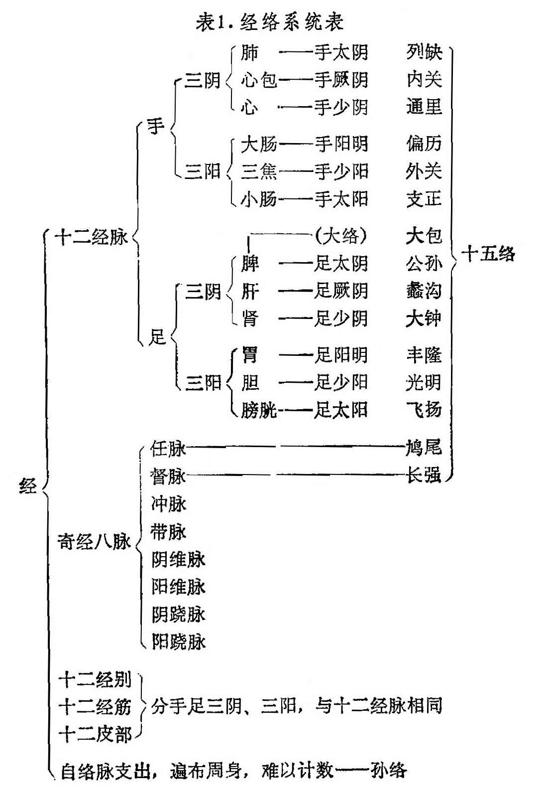

## 第二节　经络系统的组成

〔自学时数〕6学时

〔面授时学〕2学时

〔目的要求〕

1．了解经络系统的内容。

2．掌握十二经脉的体表分布规律，表里属络关系以及经脉的循行走向与交接。

3．熟悉奇经八脉的概念、特点与应用。

4．掌握任、督、冲三脉的体表循行与作用。

5．了解络脉、经别、经筋、皮部的分布特点及作用。
经络系统是由经脉和络脉组成的。经脉分为十二经脉、十二经别、十二经筋、十二皮部、奇经八脉。络脉分为十五络脉、浮络、孙络等。其基本内容如表1：

表1.经络系统表

