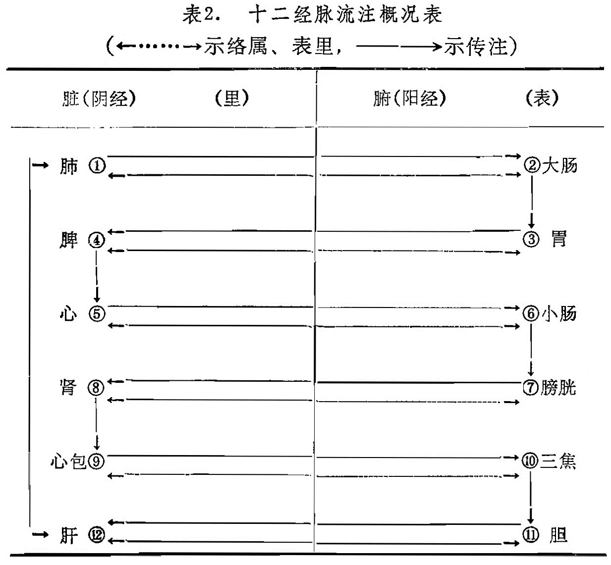

### 一、十二经脉

十二经脉即手三阴经（肺、心包、心）、手三阳经（大肠、三焦，小肠）、足三阳经（胃、胆、膀胱）、足三阴经（脾、肝、肾）的总称。十二经脉是经络系统的主体，故又称十二“正经”。十二经脉的主要作用，是联络脏腑、肢体和运行气血，濡养全身。

十二经脉的名称是根据脏腑、手足，阴阳而定的。它们分别隶属于十二脏腑，各经都用其所属脏腑的名称，结合循行手足、内外、前中后的不同部位，根据阴阳学说而赋予不同名称。如将其中隶属于六腑，循行于四肢外侧的经脉称为阳经；属于六脏（包括心包），循行于四肢内侧的经脉称为阴经。并根据阴阳衍化的道理分为三阴三阳，这样就订出了手太阴肺经，手阳明大肠经等十二经脉名称。

十二经脉在体表的分布规律：它们左右对称地分布于头面、躯干和四肢，纵贯全身，六条阴经分布于四肢的内侧和胸腹，其中上肢内侧是手三阴经，下肢内侧是足三阴经；六条阳经分布于四肢的外侧和头面、躯干，其中上肢的外侧是手三阳经，下肢的外侧是足三阳经。手、足三阳经在四肢的排列是阳明在前、少阳在中、太阳在后。手三阴经在上肢排列是太阴在前、厥阴在中，少阴在后。足三阴经在小腿下半部及足背，其排列是厥阴在前，太阴在中、少阴在后，至内踝上八寸处足厥阴经同足太阴经交叉后，循行在太阴与少阴之间，便成为太阴在前，厥阴在中、少阴在后。

十二经脉的表里属络关系：十二经脉内属脏腑，脏与腑有表里相合的关系，阴经与阳经有表里属络关系。即手太阴肺经与手阳明大肠经相表里，足阳明胃经与足太阴脾经相表里，手少阴心经与手太阳小肠经相表里，足太阳膀胱经与足少阴肾经相表里，手厥阴心包经与手少阳三焦经相表里，足少阳胆经与足厥阴肝经相表里。互为表里的阴经与阳经在体内有属络关系，即阴经属脏络腑，阳经属腑络脏，如手太阴肺经属肺络大肠，手阳明大肠经属大肠络肺等。在四肢又通过络脉的衔接，加强表里经之间的联系。这样在脏腑阴阳经脉之间就形成了六组表里络属关系。互为表里的经脉在生理上密切联系，病变时相互影响，治疗时相互为用。

十二经脉的循行走向是：手三阴经从胸走手，手三阳经从手走头，足三阳经从头走足，足三阴经从足走腹（胸）。正如《灵枢•逆顺肥瘦》所载：“手之三阴从藏走手，手之三阳从手走头，足之三阳从头走足，足之三阴从足走腹。”

十二经脉的交接：

 (1)阴经与阳经多在四肢部衔接。如手太阴肺经在食指与手阳明大肠经交接；手少阴心经在小指与手太阳小肠经交接，手厥阴心包经在无名指与手少阳三焦经交接，足阳明胃经在足大趾与足太阴脾经交接，足太阳膀胱经从足小趾斜趋足心与足少阴肾经交接，足少阳胆经从足跗上斜趋足大趾丛毛处与足厥阴肝经交接。

 (2)阳经与阳经（指同名经）在头面部相接。如手阳明大肠经和足阳明胃经都通过鼻旁，手太阳小肠经与足太阳膀胱经均通于目内眦，手少阳三焦经和足少阳胆经均通于目外眦。

 (3)阴经与阴经（即手足三阴经）在胸部交接。如足太阴脾经与手少阴心经交接于心中，足少阴肾经与手厥阴心包经交接于胸中，足厥阴肝经与手太阴肺经交接于肺中。

由于十二经脉通过手足阴阳表里经的联接而逐一流注，所以就构成了一个周而复始，如环无端的传注系统，气血通过经脉，内到脏腑器官，外达肌表，营养全身。其流注次序如表2:

表2． 十二经脉流注概况表

