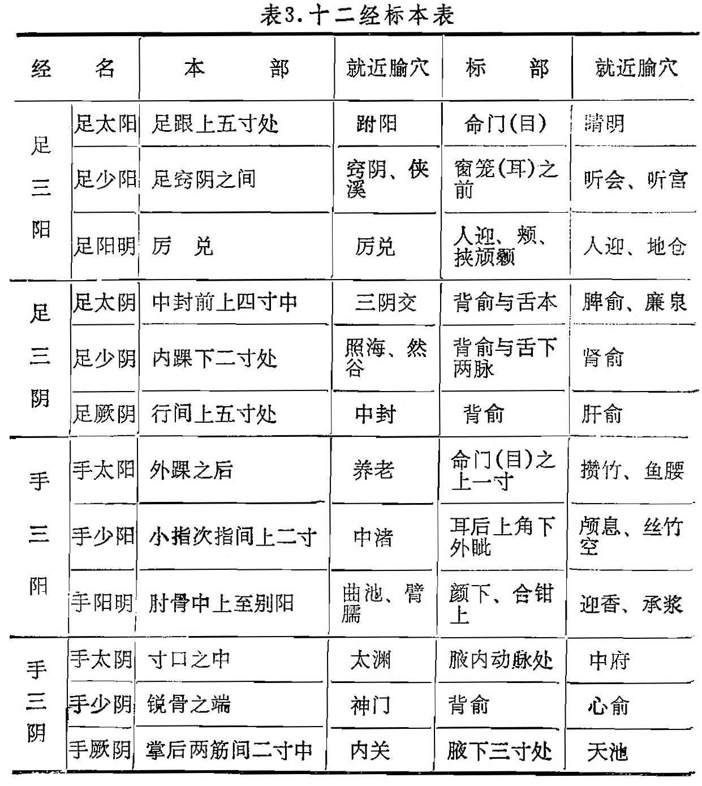

### 一、标本

1．标本的意义：在中医学理论中的标本有很多含义。如发病的先后，先病为本，后病为标；人体正邪相峙时，称正气为本，而病邪为标。在经络的分布中，标本的概念主要是指经脉腧穴分布的上下，并阐明这些上下部位具有相应性。“标”有上的含义，“本”有下的含义。头、面、胸、背位置较高在上，其部位为“标”；四肢末端位置较低在下，其部位为“本”。

2．标本的内容：十二经脉皆有本部与标部。兹将《灵枢•卫气》篇中的标本部位，结合相应腧穴，介绍如表3:

表3．十二经标本表

3．标本的应用：标本理论在诊断和辨证取穴中有重要意义。《灵枢•卫气》说：“下虚则厥”，“上虚则眩”，这是指四肢厥冷及头目眩晕，并说明治疗原则是“石（实）者绝而止之，虚者引而起之”。这是指当本虚时出现厥逆，标虚可以表现为头晕目眩，针灸应分标本而进行治疗。《标幽赋》说：“更穷四根三结，依标本而刺无不痊”，又说明标本配合根结应用。在针灸配穴中的上病下取，下病上取；标病取本，本病取标的治疗原则，都丰富了经络学说的内容。掌握标本的理论，在针灸临床上有重要的指导作用。
