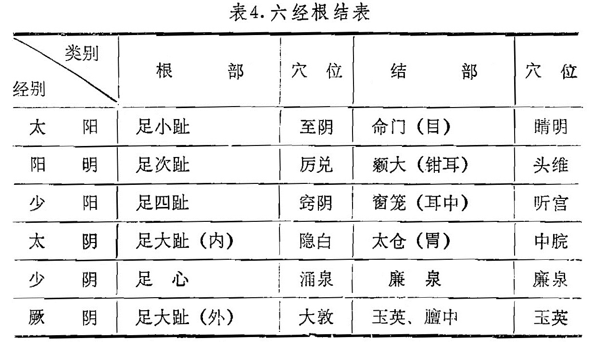

### 二、根结

1．根结的意义：“根”是指根本，开始；“结”是指结聚、归结。经脉的根结和标本有其一致性，“根”即有“本”义，而“结”即有“标”义。在身体的分布，根在四肢的末端，结在躯干头面。

2．根结的内容：十二经脉的根，即五输穴的井穴：结都分布在头、面、胸、腹。六经根结如表4：

表4．六经根结表

从表中可以看出，足三阳经的“结”均分布在头面；足三阴经的“结”均分布在胸和腹。六经根结，虽然只说的是足六经，但从井穴与头面胸腹的关联意义来理解，手六经的根结，也是与足六经相类同。《标幽赋》叙述经脉根结“四根三结”，即以手足六经并以四肢末端为根，称为四根；并结于头、胸、腹三部，称为三结。

3．根结的应用：四末是阴阳经经气流注交接的重要部位。根穴即井穴，位于四末，主治全身性疾病。如“头面之疾针至阴”，就是源于太阳经结于头面，而根于小趾的道理。反之，当四肢有病时，同样根据标本根结的理论“下病上取”，选择头面、躯干的腧穴来治疗。如《千金方》用神庭治下肢瘫；《外台秘要》用浮白穴治疗腿足痿软，都是根结在临床上的具体运用。 
