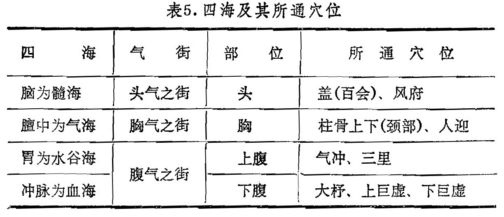

### 四、四海

1．四海的意义；海是指水流归聚之所，十二经气血象百川归海一样汇集到一定部位，由此形成了“海”的概念。《灵柩•海论》把气、血、髓、水谷四者称为人体的四海。

2．四海的内容：四海是指脑为髓海，膻中为气海，胃为水谷之海，冲脉为十二经之海，又称血海。《灵枢·海论》说：“胃者水谷之海，其输上在气街，下至三里，冲脉者，为十二经脉之海，其输上在于大杼，下出于巨虚之上下廉；膻中者，为气之海，其腧上在于柱骨之上下，前在于人迎；脑为髓海，其输上在于盖，下在风府。”四海及其所通穴位（部位）如表5:

表5．四海及其所通穴位

3．四海的应用：四海的部位与气街类似，当经络运行的气血精微汇集在一起时就形成了四海，而它们在头、胸、腹、胫的通行径路就是气街，二者部位基本一致。脑为元神之府，脑为髓之海，位于头部，与头气之街相合；膻中为气之海，为宗气之所聚，位于胸部，与胸之气街相合；胃为水谷之海，居上腹部，产生谷气，化为营气和卫气，与腹之气街相合；冲脉为血海，即十二经脉之海，它交于足少阴，《难经》称脐下肾间动气，位于下腹，又与胫气之街一致。《难经》又说：“三焦者，原气之别使也”，即元气通过三焦，而分布到全身各处。

当四海有余或不足时，还会出现某些病证。如“气满胸中”、“少气不足言”，“腹满”、“饥不受谷食”，“脑转耳鸣，胫痠眩冒”等，皆可选用“四海”中相应的腧穴治疗。

**复习思考题**

1．试述十二经脉标本、根结的概念及其分布特点。

2．什么叫气街，它对针灸临床有何意义？

3．十二经脉标本的腧穴有哪些 ？

4．何谓四海？其上下腧穴各是什么？