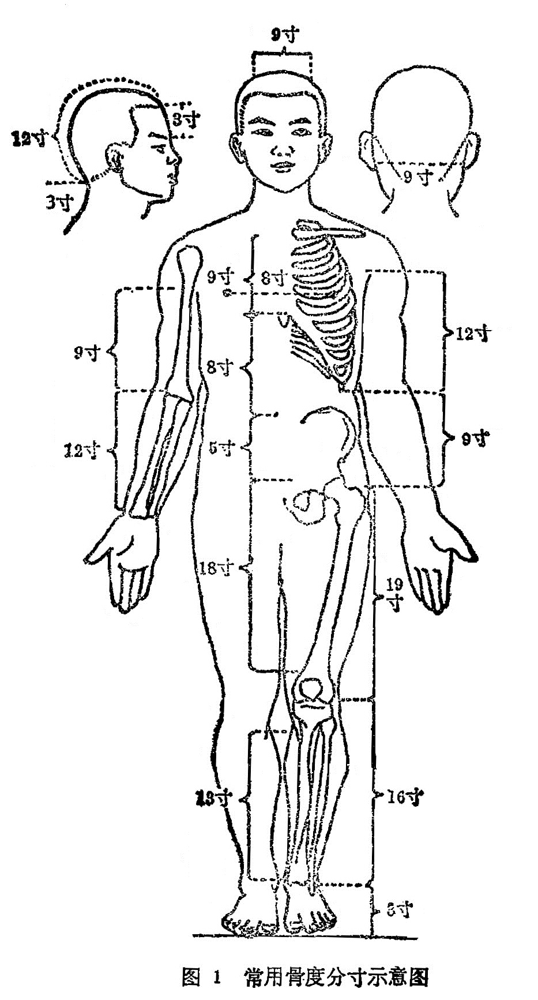
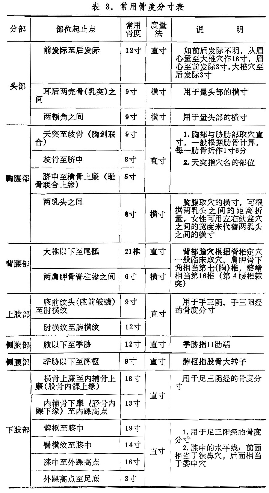
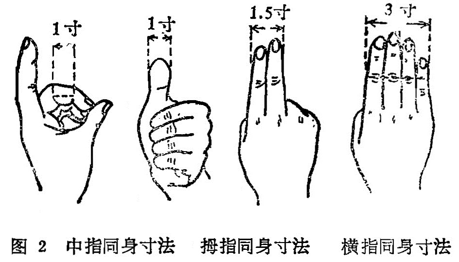

## 第七节　腧穴的定位

〔自学时数〕2学时

〔面授时数〕1学时

〔目的要求〕

掌握腧穴的定位方法。

腧穴的定位，习惯叫取穴。取穴正确与否，直接影响治疗效果。现在临床常用的腧穴定位法可分为骨度分寸法、自然标志取穴法、手指同身寸取穴法、简便取穴法四种。

### 一、骨度分寸法

骨度分寸法，古称“骨度法”，始见于《灵枢·骨度》篇。它是将人体的各个部位分别规定出折算长度，作为量取腧穴的标准。不论男女、老少、高矮、胖瘦的人，均可按着这个标准测量。人体各部常用骨度分寸法如图1、表8：

 

附注：根据《灵枢·骨度》篇记载：发以下至颐长一尺，两颧之间相去七寸，结喉以下至缺盆中长四寸，足长一尺二寸等。现代临床折量，多以自然标志取穴，或以手指同身寸代之。

### 二、自然标志取穴法

根据人体自然标志而定取腧穴。可分为固定标志和活动标志两类：

1.固定标志：指不受人体活动影响而固定不移的标志。如五官、毛发、爪甲、乳头、脐窝以及骨节凸起和凹陷、肌肉隆起等部位作为取穴标志而言。如鼻尖取素髎，两眉间取印堂，两乳间取膻中，脐中取神阙，腓骨小头前下缘取阳陵泉，第七颈椎棘突下取大椎。此外，可依肩胛岗平第三胸椎棘突、肩胛骨下角平第七胸椎棘突、髂嵴平第四腰椎棘突为标志，取背腰部腧穴。

2.活动标志：指必须采用相应的动作姿势才能出现的标志。例如取耳门、听宫、听会等穴，应张口；取下关，应闭口。取曲池，应屈肘于横纹头处取之；取养老穴时，正坐屈肘，掌心向胸，当尺骨茎突之桡侧骨缝中是穴；取后溪穴时，要握拳于横纹头等。

### 三、手指同身寸取穴法

以患者的手指为标准，来定取腧穴的方法。人的手指长度和宽度与其它部位有着一定的比例，所以用患者本人的手指来测量定穴，或权衡患者高矮胖瘦的情况，以医者的手指来测定穴位。临床常用的有以下三种：

1.中指同身寸：是以患者的中指中节屈曲时内侧两端纹头之间作为1寸（如图2），适用于四肢部取穴的直寸和背部取穴的横寸取穴。

2.拇指同身寸：是以患者拇指指关节的横度作为1寸（如图）,也适用于四肢部的直寸取穴。

3.横指同身寸：又名“一夫法”，是令患者将食指、中指、无名指和小指并拢，以中指中节横纹处为准，二指横量作1.5寸，四指横量作为3寸（如图2），此法多用于下肢、下腹部和背部的横寸。

### 四、简便取穴法

是临床上常用的一种简便易行的取穴方法。如垂手中指端处取风市，两手虎口交叉取列缺，两耳尖直上取百会，垂臂屈肘合腋于肘尖着点处取章门等。

### 〔临床应用〕

在临床上要获得正确的腧穴定位，须明确取穴法。金·窦汉卿《标幽赋》曾说：“取五穴用一穴而必端，取三经用一经而可正”。明确指出取穴时必须力求审慎。

本节介绍的各种取穴法，必须牢牢掌握，各穴适合哪种取穴法，就应用哪种取穴法，要点是取穴准确，才能发挥腧穴的应有作用。

复习思考题

1.常用取穴方法有几种？临床上以哪一种最为常用？

2.何谓骨度分寸法？并举出常用骨度的分寸。
