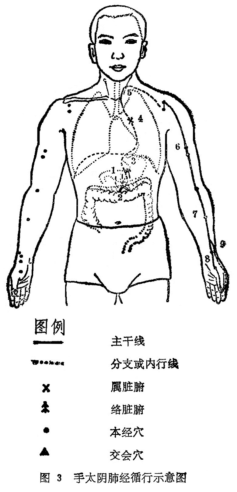

#### (―)分布络属

分布径路：从胃部（中焦）开始，向下联络大肠，回上来沿着胃上口，穿过膈肌，入属肺脏，从肺系（气管、喉咙）横向侧胸上部浅出体表，走向腋部，沿上肢内侧前边，到手掌大鱼际边缘，沿拇指桡侧到指端。

它的一条分支，从腕后桡骨茎突的上方分出，沿掌背侧走向食指桡侧端，交给手阳明大肠经（图3）。

络属脏腑：属肺，络大肠。

经过器官：肺系（气管），喉咙。

本经腧穴：

一手太阴是肺经，臂内拇侧上下循。

中府乳上数三肋，云门锁骨窝里寻，

二穴相差隔一肋，距腹中线六寸平。

**天府**腋下三寸取，**侠白**肘上五寸擒。

**尺泽**肘中大筋外，**孔最**腕上七寸凭。

**列缺**交叉食指尽，**经渠**寸口动脉行。

 **太渊**掌后纹头是，**鱼际**节后散脉荥。

**少商**穴在大指内，去指甲角一分明。

图解：肺手太阴之脉：①起于中焦，②下络大肠，③环循胃口，上膈， ④属肺，⑤从肺系横出腋下，⑥下循臑内，行少阴、心主之前，⑦下肘中，循臂内上骨下廉，入寸口，⑧上鱼，循鱼际，出大指之端。其支者，⑨从腕后直出次指内廉，出其端（《灵枢•经脉》）。
