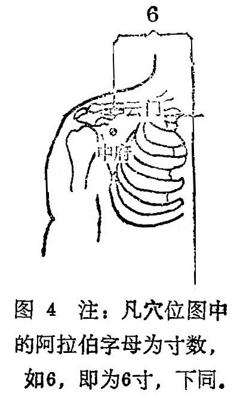

##### 云门

〔定位〕任脉旁开6寸，锁骨下缘处取穴（图4）。

〔解剖〕有胸大肌，皮下有头静脉，深部有胸肩峰动脉分布，布有胸前神经的分支，臂丛外侧束及锁骨上神经。

〔功能〕调理肺气，止咳镇痛。

〔主治〕咳嗽，气喘，胸中烦满热痛，肩臂不举，麻木，疼痛。

 〔刺灸〕向外斜刺0.5〜0.8寸，可灸。

〔讲述〕出《素问•水热穴论》。人之气血，始于手太阴，出于云门；归于足厥阴，入于期门。肺气在人体中，犹如云雾，首出其门而得名。本穴与中府仅相隔一肋，故能治本经之气喘，咳嗽之疾，但无募穴之特殊性。由于针刺本穴，其得气能沿经传达到上肢远端，故常作为治疗肩臂内侧疼痛，以及上肢麻木等症的主要经穴。《甲乙》：主治肩痛不可举，引缺盆痛。《铜人》：治肩痛不得举臂。穴下有肺脏，不宜直、深刺，可观身体胖瘦，剌0.5〜 0.8寸，或斜刺为宜，过深伤肺，令人逆息，喘逆仰息。

