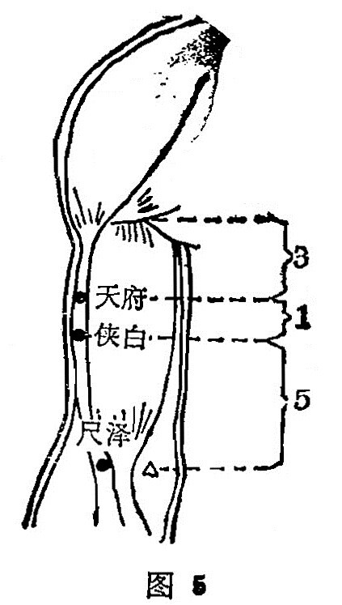

##### 侠白

〔定位〕天府穴下1寸，尺泽上5寸(图5)。

〔解剖〕在肱二头肌桡侧；有头静脉,肱动脉分支,布有臂外侧皮神经及肌皮神经。

〔功能〕调肺气，止疼痛。

〔主治〕咳嗽，心痛，上臂内侧痛。

〔刺灸〕直刺0.5〜1寸，可灸。

〔讲述〕侠白一名夹白，侠同挟，有保护之意。因穴在上臂内 侧，适当肺脏的两旁、肺应白色，穴挟其旁，因名。取本穴应请 患者手臂垂直，掌心向前，从腋前横纹头到肘横纹划成三个等分， 上1/3处（即腋下3寸）取天府，天府下1寸取侠白，二穴均在肱 二头肌的桡侧沟中。侠白除具有宣通肺气之效外，又主上臂内侧疼 痛、麻木。由于穴系手太阴肺经之经别，散于胸中，故用于胸中烦满，心悸，心痛诸疾，有理气止痛之效。《甲乙》：主治心痛，咳干 呕满。《大成》：主心痛短气，干呕逆烦满。临床常配心俞、内关， 膈俞能增强疗效。另外点刺出血（局部）加灸治赤白汗斑。

