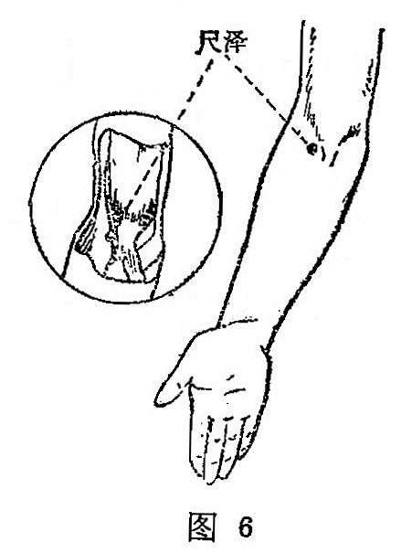

##### 尺 泽

〔定位〕仰掌，肘部微屈，在肘横纹中，肱二头肌腱的桡侧缘， 当[侠白](https://www.gmzyjc.com/read/zjs/zjs3.1.1-3-0.1.1.3.4.md)下5寸处（图5、6)。

〔解剖〕在肱二头肌腱的桡侧,肱桡肌起始部;有头静脉,挠返动静脉分支；布有前臂外侧皮神经,桡神经本干。

〔功能〕清泄肺热，肃降和中。

〔主治〕咳嗽，哮喘，胸满，咯血，潮势、咽痛，肘挛痛，吐泻。   

〔刺灸〕直剌0.5〜1寸；或点刺出血，可灸。

〔讲述〕[尺泽](https://www.gmzyjc.com/read/zjs/zjs3.1.1-3-0.1.1.3.5.md)别名鬼受。古代以前臂部称尺，《灵枢•骨度》将从腕至肘定为一尺，本穴为肺之合，阴经之合属水，水当润泽，穴处低凹如沼泽，因名。取本穴有三法：一是屈肘、拱手，于大肠经[曲池](https://www.gmzyjc.com/read/zjs/zjs3.1.1-3-0.1.2.3.11.md)内一寸横纹端取之；二是屈肘仰掌，在肘横纹中央，大筋（肱二头肌腱）外侧凹陷中取之；三是伸臂使肘静脉暴露，于该穴处点刺出血。穴属肺经脉气之所入，为本经合水穴，具有清肺热，泻肺火，降逆气，止咳喘之功效。故可用治咳逆上气，唾血以及咳唾脓血，肺积息贲，临床可配[鱼际](https://www.gmzyjc.com/read/zjs/zjs3.1.1-3-0.1.1.3.10.md)能增强疗效。其次用治局部肘痛筋挛，手臂拘挛急，具有舒筋活络，止痛缓急之效。近代又用治吐泻症，点刺出血可止吐泻，有和中止痛之效。《资生》:[尺泽](https://www.gmzyjc.com/read/zjs/zjs3.1.1-3-0.1.1.3.5.md)主呕泄上下出。本穴《金鉴》认为禁灸；《素问•刺禁论》认为剌肘中内陷，气归之，为不屈伸。这里的气指恶气，病患，实际是刺本穴应避开动脉，以免出血。
