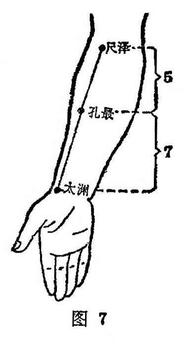

##### 孔最

〔定位〕在尺泽和太渊连线上，腕横纹上7寸处（图7)。

〔解剖〕在肱桡肌内缘,针尖可达到旋前圆肌下端。浅层有头静脉和前臂外侧皮神经；深层有桡神经浅支和桡动静脉。

〔功能〕润肺止血，解表清热。

〔主治〕咳嗽，气喘，咯血，咽痛，失音，热病汗不出，肘臂痛。

〔刺灸〕点刺1〜1. 5寸，可灸。

〔讲述〕见于《甲乙》。孔，指通；最，有第一的含意。本穴主治热病汗不出，针之能宣通肺气，开泄腠理，犹如通中发汗，最为第一，因名。取本穴应微屈肘，使掌心向上，先于肘弯大筋外侧点尺泽，再于腕横纹头处定太渊，于尺泽与太渊连线距腕7寸处定孔最，适当桡骨尺侧边，故伸肘手虎口向上握拳时，此处凹陷最为明显，且有压痛是穴。穴属肺郄，是肺经气血深集之处，具有清热解表，宣肺平喘，降气止血之功效。如《外台》：治热病汗不出；《玉龙经》：治太阴热病无汗;《大成》：治吐血，失音，咽肿头痛。为增强疗效，临床常配合谷治高热无汗，可降热解表；配肺俞、风门、大椎治咳喘，能宣肺止嗽定喘；配少商点刺出血治咽肿喉痹，能清咽止痛。日本泽田氏谓本穴灸之能治肛痔。
