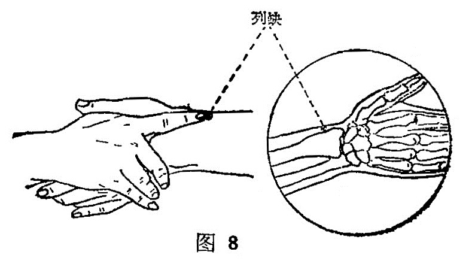

##### 列缺

〔定位〕桡骨茎突上方，腕横纹上1.5寸，或两手虎口交叉， —手食指按在挠骨茎突上，指尖下凹陷是穴（图8)。

〔解剖〕针经肱桡肌腱与外展拇长肌腱之间,到达旋前方肌桡侧缘。浅层有头静脉的属支和桡神经浅支；深层有桡动静脉分支。

〔功能〕宣肺疏风，通调任脉。

〔主治〕头痛，项强，咳喘，瘾疹，咽肿痛，口眼㖞斜，腕痛无力，遗溺，溺血阴中痛。

〔刺灸〕向肘部斜刺0. 5〜0. 7寸，可灸。

〔讲述〕别称童玄。列，指分解，别行，与裂义通；缺，指器破缺口之意。因穴位于手腕侧，当桡骨突起的分裂缺口处，是手太阴之别络，经脉从此别行，斜走食指内侧，因名。本穴为本经 之络，又是八脉交会之一，通于任脉，临床应用范围较广，故后人将它列人四总穴之内、具有宣肺疏风，清热解表，通经活络、调理任脉的功效。《千金》：配后溪、少泽、前谷治疟寒热。《资生》：配完骨治口面㖞。《玉龙赋》：配太渊治咳嗽风痰。除此之外，“头项寻列缺”，多用治头项疾患，善疗偏正头痛。因穴属本经络穴，联系表里两经，肺脉由此别走手阳明；阳明大肠经从手走头，上达颈项，口齿，故头项寻列缺，体现了表里同治的规律；加之肺脉由此内通任脉，所谓列缺任脉行肺系，而任与督脉相会于头顶，头项强痛一般由外感引起，《伤寒论》说：外邪伤入，先伤皮毛。而肺主气，外合皮毛，针肺之络，可宣通肺气，疏泄风邪，故主一切头项疾患，所以《甲乙》指出：热病，先手臂瘈疭，唇口紧，鼻张，目下，汗出，列缺主之。本穴临床又可用治遗尿症，因肺之别络，别走大肠，又为肺、任内连之处；肺主气，为水之上源，大肠系津液之府，任脉为诸阴之统汇，故当肺气不足，导致膀胱失职，刺列缺能开泻肺气而止遗溺，临床采用埋针方法，可增强疗效。列缺内通任脉，任起胞中，还可用于前阴诸疾，如溺血，小便热，阴茎痛，妇人血气不和，胎衣不下等。近代研究证明，刺之能使尿中排碘量降低，使甲状腺中碘131的半衰期有所延长。
