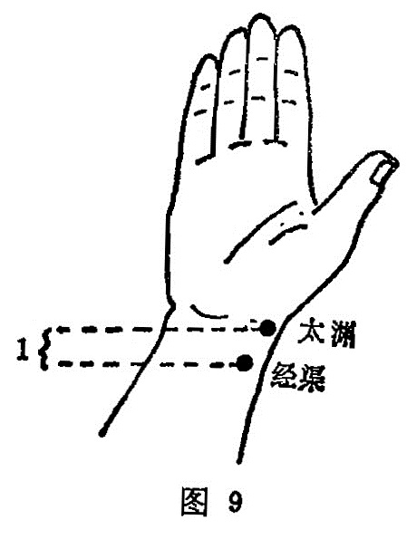

##### 经渠

〔定位〕在胞横纹上1寸，当桡骨茎突内缘与桡动脉之间凹陷处（图9） 。

〔解剖〕在桡侧腕屈肌腱与拇长展肌腱之间,在桡动静脉桡侧；深层有旋前方肌；布有前臂外侧皮神经和桡神经浅支的混合支。

〔功能〕宣肺平喘，清热止痛。

〔主治〕咳嗽，咽肿痛，腕痛。

〔刺灸〕避开动脉，直刺0. 2〜0.3寸，禁灸。

〔讲述〕出《灵枢•本输》。经，指通路；渠，为水道。穴当寸口，为肺经所行之经穴，是肺经经气经过的冲渠要道，因名。本穴适当桡骨茎突的最高点的掌面内侧缘骨边，相当诊脉的寸、关、尺三部脉中的关部，有动脉应手处是穴。针刺时应避开动脉。简易取法是虎口交叉，食指尖附着点为列缺；于食指爪甲根下取经渠。本穴多用于本经所发生的咳逆，喘息，喉痹，咽肿之疾。《甲乙》：治胸中膨膨然，甚则交两手而瞀，暴痹喘逆。《千金》：治咳逆上气，喘，掌中热，臂内廉痛。这是本“经主喘咳寒热"的法则， 刺之能收宣肺清热，恢复肃降，下气平喘的功效。
