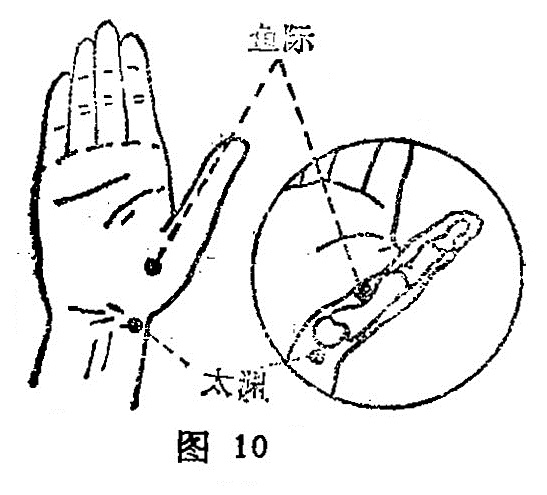

##### 太渊

〔定位〕掌后腕横纹桡侧端，挠动的桡侧凹陷中（图10)。

〔解剖〕在桡侧腕屈肌之外侧，拇长展肌腱之内侧；有桡动静脉；布有前臂外侧皮神经和桡神经浅支的混合支。

〔功能〕宣肺止咳，通脉理盛。

〔主治〕咳嗽，气喘，咯 血，呕血，喉干咽痛，胸痛，无脉症，腕臂痛。

〔刺灸〕避开挠动脉，直 刺0.2〜0. 3寸，可灸。

〔讲述〕出《灵枢•本 输》。别称太泉、鬼心。渊、泉，字义同；太，有大、甚之意。深处为渊，穴当寸口，是肺经脉气最旺盛之处，为脉之大会所，因名。它的定位，诸书记载在掌后拇指侧横纹头，大筋内侧凹陷中。人体腕横纹一般有二条，也有三条的。本穴应在掌后第一横纹头处，于大多角骨的桡侧，适当切脉之寸部。穴属俞土，又系原穴，为肺经脉气聚会之所，肺属金，穴属土，土为金之母，故本穴为肺经之母穴，凡一切肺虚引起的气 短，咳喘，补之能宣通肺气，益气补虚。临床常配列缺治胸痛； 配尺泽治肘痛；配鱼际治咽干；配列缺、鱼际治咳喘，配内关、四缝治百日咳。近年常用太渊治疗无脉症，配心俞、厥阴俞、内关有一定疗效。研究表明，肺有辅助心脏主宰人体血液循环的作用，肺气流经，经气归于肺，肺朝百脉，“肺代心主而行营卫，故治节由之”（王冰语)。此外，针刺本穴能减低吸气或呼气阶段的气道阻力。

