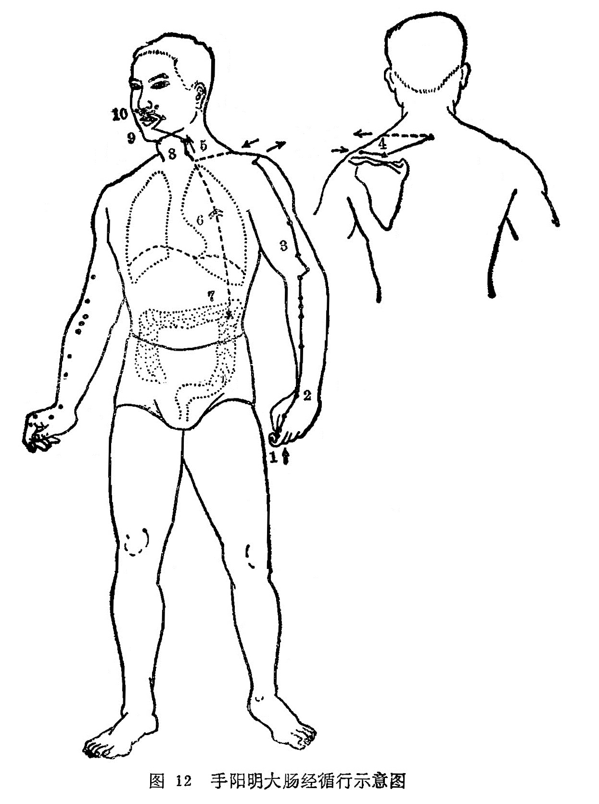

#### （二）本经证候：

图解：大肠手阳明之脉，①起于大指次指之端，循指上廉，出合谷两骨之间，②上入两筋之中，循臂上廉，入肘外廉，③上臑外前廉，上肩，出髃骨之前廉，④上出于柱骨之会上，⑤下入缺盆，⑥络肺，下膈，⑦ 属大肠。

其支者，⑧从缺盆上颈、贯颊，⑨入下齿中，还出挟口，交人中——左之右，右之左，⑩上挟鼻孔（《灵枢、经脉》）。

经证：目黄，口干，鼻流清涕，出鼻血，齿痛，颈肿，喉咙痛，肩臂前加疼痛，食指不能运用，经脉分布处出现灼热肿胀，或僵冷（均属本经病)。

腑证：可见肠中切痛，便秘，泄泻，下血，脱肛，飧泄怯冷诸疾。正如经文所述：是动则病齿痛颈肿。是主津液所生病者，目黄口干，鼽衄，喉痹，肩前臑痛，大指次指痛不用。气有余则当脉所过者热肿，虚则寒慄不复（《灵枢•经脉》）。