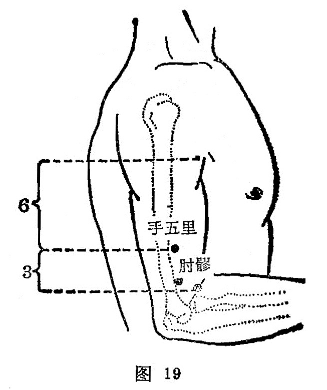

##### 手五里

〔定位〕在曲池与肩髃连线上，距曲池上3寸(图19)。

〔解剖〕在肱桡肌起始部，肱三头肌前缘，深层为挠侧副动脉，布有前臂背侧皮神经，深层为桡神经。

〔功能〕通经，散瘀，止痛。

〔主治〕肘臂挛痛，瘰疬。

〔刺灸〕避开动脉直刺0.5〜1寸，可灸。

〔讲述〕出《灵枢•本 输》。别称大禁。里有邑、居 的意思，因穴在天府下5寸，三里上5寸，古时以一寸为
 一里，因名。本穴主治肘臂疼痛麻木，刺之有疏筋利节之功效。还可用于痎疟、颈疬。《图翼》载：风劳惊恐，吐血咳嗽，嗜卧，肘臂疼痛难动，腹满气逆，寒热瘰疬，目视𥆨𥆨，痎疟。 《甲乙》：禁不可刺，多主张灸，左取右，右取左。因该处有桡侧副动脉，避开动脉直刺。

