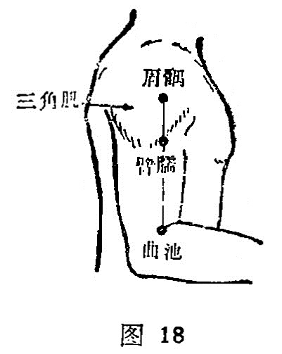

##### 臂臑

〔定位〕在曲池与肩髃连线上，距曲池上7寸，当三角肌下端 （图 18）。

〔解剖〕在三角肌下端，肱二头肌外侧头的前缘，有旋后动脉的分支及肱深动脉，布有前臂背侧皮神经，深层有桡神经本干。

〔功能〕疏筋活络，清热明目。

〔主治〕肩臂痛，瘰疬，目疾。

〔刺灸〕直刺或向上斜刺0. 5〜1.5寸，可灸。

〔讲述〕见于《甲乙》。别称头冲、颈冲、臂脑。臑，指上臂内侧。据《正字通》载：自肩到腕为臂，自肩到肘为臑。因本穴位于臂三角肌下方偏内侧，主治肩关节疾病，故名。《甲乙》：治寒热项疬，适肩臂痛不可举。这是因为本穴为手阳明大肠经、手太阳小肠经、足太阳膀胱经和阳维之会所，刺之能疏筋止痛，行气散瘀。临床常配曲池治瘰疬；配光明治目疾；配合谷、膻中治癫痫。

