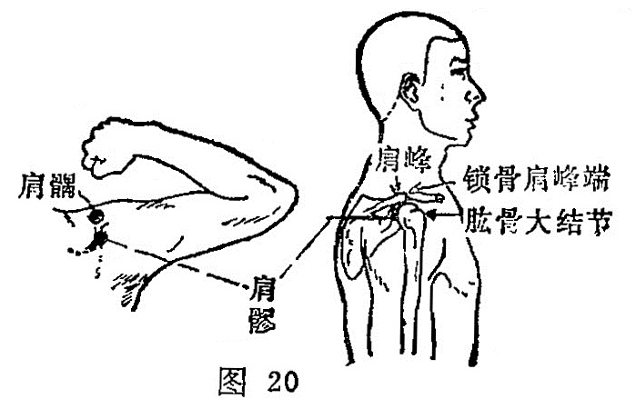

##### 肩髃

〔定位〕三角肌上部中央，肩峰与肱骨大结节之间，当上臂外展至水平位时，出现两个凹陷，在前方的凹陷处（图
 20）。

〔解剖〕浅层有锁骨上神经，深层有旋后动静脉及腋神经的分支。

〔功能〕祛风热，通经络，利关节。

〔主治〕肩背、手臂痛，上肢不遂，瘰疬，风热瘾疹，肝阳上亢。

〔刺灸〕直刺或斜刺0.5〜1寸，可灸。

〔讲述〕出《灵枢•经脉》。别称髃骨、中肩井、扁骨、扁尖。肩指肩部，髃指肩胛骨。因穴位肩上髃骨处，为手阳明大肠和阳 跷脉之会，主治肩关节诸疾，因名。《玉龙经》：治中风半身不遂， 手臂挛急，筋骨酸痛，风热瘾疹。《玉龙歌》：肩端红肿痛难当，寒湿 相争气血旺，若问肩髃明补泻，答君多灸自安康。临床配曲池、阳陵泉、昆仑治肢节烦痛，牵引腰脚痛；配阳溪治瘾风之热；配条口治肩疼；配阳陵泉、曲池、绝骨治偏瘫，一般弛缓不遂，施 用补法，可补虚壮筋；强直不遂，施用泻法，可活络舒筋。
