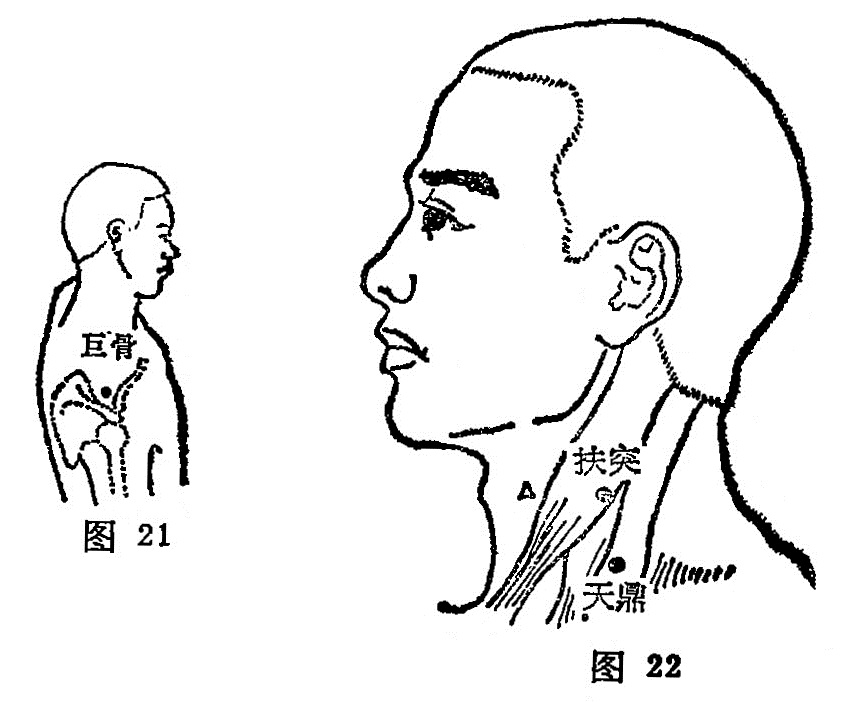

##### 巨骨

〔定位〕正坐垂肩，在锁骨肩峰端与肩胂冈之间凹陷中(图21) 。

〔解剖〕在斜方肌与冈上肌中，深层有肩胛上动静脉，布有锁骨上神经后支，副神经分支，深层为肩胛上神经。

〔功能〕散瘀，止痛。

〔主治〕肩痛，手臂不得屈伸，瘰疬，瘿气。

〔刺灸）直刺0. 5〜0. 8寸，可灸。

〔讲述〕出《素问•气府论》》巨指大，巨骨即锁骨。本穴正当锁骨外端，人之锁骨虽然不大，但位居肩端，当人荷重之时，此骨支持重力，以维护胸腔脏器不受压迫，故不言锁而名为巨骨 。穴属手阳明大肠和阳蹻脉之会所，除用于肩痛，手臂不得屈伸，有舒筋利节之效外，还可用于瘰疬，瘿气，有消瘿散结之力。临床常配前谷治臂不举；配绝骨治头项强痛。《素注》： 禁针，针则倒悬，一食倾，乃得下针，针4分，泻之勿补，针出始得正卧。

