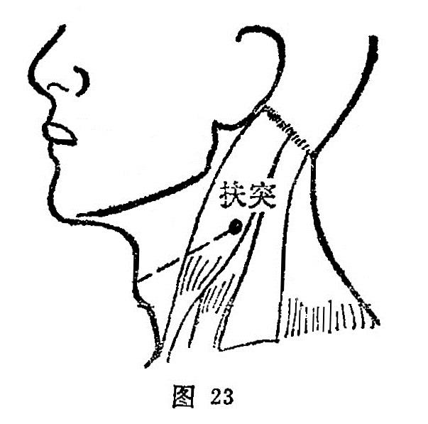

##### 扶突

〔定位〕喉结旁开三寸，当胸锁乳肌的胸骨头与锁骨头之间( 图 23）。

〔解剖〕有颈阔肌，胸锁乳突肌，颈外动脉分支，布有耳神经，颈皮神经，枕小神经及副神经。

〔功能〕宣肺气，利咽喉。

〔主治〕咳喘，咽痛，暴喑气哽，瘰疬，气瘿。

〔刺灸〕直刺0.5〜0.8寸，可灸。

〔讲述〕出《灵枢•本输》。别称水穴。高起之处为突，此指喉结，扶约当今4横指，等于同身寸3寸，因本穴位于喉结突起，旁开一扶3寸，因名。《甲乙》：主治咳逆上气，咽喉呜喝喘息。《大成》：治咳嗽多唾，上气咽引喘息，喉如水中鸡声，暴喑气哽。临床常配廉泉治暴喑气梗；配大钟、窍阴治舌本出血；配天突治喘息痰鸣作水鸡声，这是因为肺系急而不舒，肺之关门不利，刺此可缓解肺系之挛急，消除气逆，则关门得利，痰浊降而气喘平，清肃之气得行则语出。
