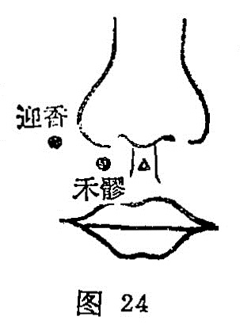

##### 禾髎

〔定位〕水沟旁开0.5寸（图24）。

〔解剖〕在上唇方肌止端，有面动静脉的上唇支，布有三叉神经第二支之下支，与面神经的吻合支。

〔功能〕祛风，开窍。

〔主治〕鼻塞，不闻香臭，鼻衄，口噤不开。

〔刺灸〕直刺或斜刺0.2〜0.5寸，可灸。

〔讲述〕见于《甲乙》。别称长频、长颊、长巅。禾指粮，其穴在鼻孔之下，口唇之上，人中之旁，取其鼻欲嗅，口食谷，穴当其际；因名。本穴主要用于局部之鼻窒，口僻，不闻香臭，有祛风、开窍之力。《甲乙》：治鼻窒，口僻，清涕出，不可止，鼻衄有痈。《大成》：主尸厥及口不可开，鼻疮息肉，鼻塞不闻香臭，鼻衄不止。临床常配地仓、颊车治口㖞；配合谷、印堂、上星治鼻衄、鼻窒。

