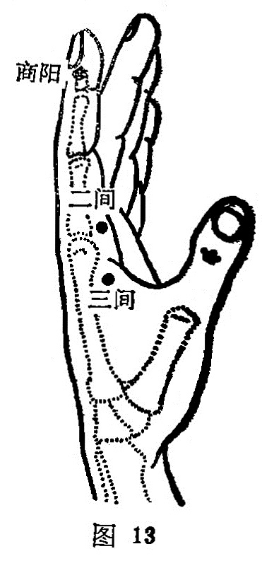

##### 三间

〔定位〕微握拳，当第二掌指关节后凹陷中（图13)。

〔解剖〕有第一骨间背侧肌，深层为拇内收肌横头；有手背静脉网，指掌侧固有动脉；布有桡神经浅支。

〔功能〕清热，散风，行气。

〔主治〕齿痛，目痛，咽喉肿痛，多寐，腹满肠鸣，指掌关节 肿痛。

〔刺灸〕直刺0. 5〜0.8寸，可灸。

〔讲述〕出《灵枢•本输》。别称少谷。穴义同二间。本穴为本经俞木穴，除主治齿痛，目赤，咽痛外，还可用于腹满肠鸣，有行气之效。《甲乙》：多卧善唾，腹满肠鸣。《千金翼》：喉痹肿如哽，齿龋痛恶清，多卧善唾，腹满肠鸣。《图翼》：肠鸣洞泄，《纲目》：大便不通并伤寒水结，取三间沿皮向下至合谷，三补三泻，候腹中通出针，承山七分泻之。由此可见，三间长于本经所发生的肠鸣亢进，急性下泄之疾；为加强疗效，临床配伍天枢、足三里疏通腑气，疗效更捷。另外，还可用于局部手指拘急，握拳不开，手背红肿，宜用长针深透后谿有效。这是因为三间、后溪皆为俞木，二穴相合，俞木合力，不仅能通腑行气，清泻大肠，且可通调督脉，达到活络止痛之效。

