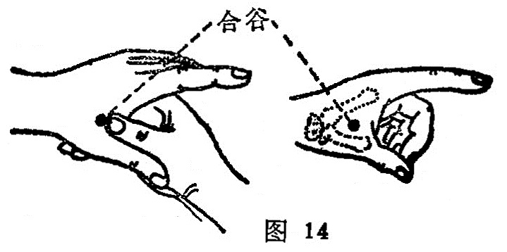

##### 合谷

〔定位〕在手背第一、二掌骨之间，近第二掌骨桡侧缘的中点；或以拇指指关节横纹正对虎口边，拇指按下当拇指尖处（图14）。

〔解剖〕在第一骨间背侧肌中，深层为拇内收肌横头，有手背静脉网，近侧正当桡动脉穿向手掌处；布有桡神经浅支的掌背侧神经，深部为正中神经的指掌侧固有神经。

〔功能〕疏风解表，通络镇痛。

〔主治〕头痛，齿痛，鼻衄，目赤肿痛，面肿，口眼㖞斜，腮肿， 热病无汗，多汗，腹痛，经闭，滞产，风疹，痢疾，以及小儿惊风。

〔刺灸〕直刺0.5〜1.0寸，可灸。

〔讲述〕出《灵枢•本输》。别称虎口。肉之大会为谷，二处相连为合，又有交结、集会之意，因穴处适当大，次指相合处，是 处形似深谷，因名。本穴为大肠经所过之原穴，后世总结为四总穴之一。由于原穴与三焦关系密切， 它导源于脐下肾间动气，关 系人体的气化功能，是增强整体功能的要穴，所以合谷具备多种 项能，有疏风解表，清热宣肺，行气开窍，通降肠腑，镇静安神， 以及通经活络之效。其所以能治面口五官之疾，乃因大肠经的支脉，从缺盆分出，上走颈，过颊，入下齿龈，又回出绕口唇，从 人中处交叉，夹行鼻孔两侧；它的筋经，起于次指之端，结于腕，沿前臂、肘外、臑部，上达头面，可见本穴主要经过面口各部， 所以才有“面口合谷收”临床名言。加之本是动及所生病，主要 是齿痛，颈肿，目黄，口干，鼽衄，喉痹，而合谷是本经原穴，原主本经诸疾。为加强疗效，凡头风，头痛，牙痛配三间；目赤配内迎香出血；耳聋配临泣、金门；鼻塞鼻痔配太冲；鼻衄配天府； 咽肿配少商；感冒配风池、列缺、外关；上肢不遂配曲池。本穴 配太冲名四关穴，具有镇静，搜风，行瘀，通络之效。由于阳明常多气多血，手足阳明会于迎香，所以气血不足，经闭不通，补大肠原穴合谷能使气血旺盛则经闭自通。《甲乙》说：难产补合谷， 泻三阴交。这是因为任脉起于胞中，气血不足，经气闭塞，而肺 与大肠相表里，肺脉起于中焦任脉之中脘；大肠会于任脉之承浆， 故取大肠之原穴，能通畅任脉，旺盛气血。但对于孕妇，禁刺合谷，免损胎气。

本穴针刺反应较强，一般稍稍捻转，即可产生酸胀，并向上下扩散。所以对初次受针及虚弱者，宜轻针浅刺，达到酸胀即止，留针不宜过长，以免发生晕针。对实症，体壮采用泻法，刺激较强，易产生局部甚至两手沉重，指掌握物无力，以及局部肿胀疼痛等，应针后轻揉，以宣散气血，减少疼痛，出血肿胀。