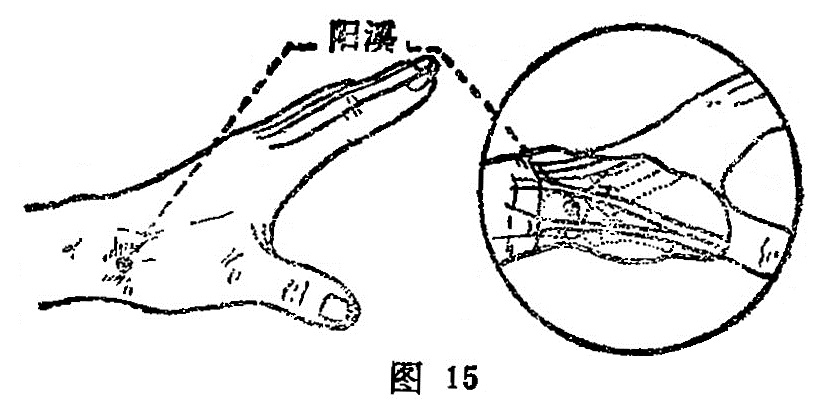

##### 阳 溪

〔定位〕腕背桡侧，当拇指翘起时，穴在拇短伸肌腱与拇长 肌腱之间的凹陷中（图15）。

〔解剖〕在拇短伸肌腱与拇长伸肌腱之间；有头静脉，桡动脉本干及其腕背支；布有桡神经浅支，前臂外侧皮神经。

〔功能〕清热散风。

〔主治〕头痛，齿痛，目赤，耳聋，寒热，疟疾，癫狂，腕痛。

〔刺灸〕直刺0.5〜0.8寸，可灸。

〔讲述〕出《灵枢•本输》。别称中魁。溪，原为谿，肉之小会为谿。穴属手阳明位于手掌外侧两筋凹陷处，该处形似小谿，因名。本穴为本经之经穴，除主实痛，目赤，耳聋，齿痛，腕痛诸疾外，还可配[天容](https://www.gmzyjc.com/read/zjs/zjs3.1.4-6-0.0.3.3.17.md)治胸满不得息；配[肩髃](https://www.gmzyjc.com/read/zjs/zjs3.1.1-3-0.1.2.3.15.md)可消瘾风之热；配[二间](https://www.gmzyjc.com/read/zjs/zjs3.1.1-3-0.1.2.3.2.md)治牙齿肿痛、咽痹。近世常配[天突](https://www.gmzyjc.com/read/zjs/zjs3.2.1-0.1.1.3.20.1.md)、[间使](https://www.gmzyjc.com/read/zjs/zjs3.1.9-12-0.0.1.3.5.md)治食道痉挛和咽喉气梗；配解谿能止惊悸怔忡，此乃因手足阳明之热得泄，经气通畅、肠胃安宁，故热退惊止，怔忡得除。
