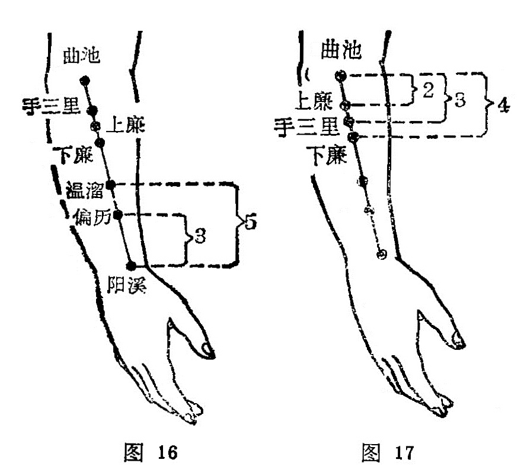

##### 上廉

〔定位〕在阳溪与曲池连线上，距曲池下3寸。(图17)。

〔解剖〕同下廉。

〔讲能〕通经络，调腑气，利关节。

〔主治〕肩臂疼痛，麻木，半身不遂，腹痛肠鸣。

〔刺灸〕直刺0.5〜0.8寸，可灸。

〔讲述〕见于《甲乙》，在三里下一寸。上指上方，与下相对，廉形如菱角之状，又指边侧，因穴在下廉上一寸，屈肘握拳，是处肌肉隆起，形如菱状，穴当菱状边侧，因名。此穴除主上肢不遂，手臂麻木，肩臂疼痛外，还可用于肠鸣走痛，大肠气滞，可调腑气，除瘀滞。

