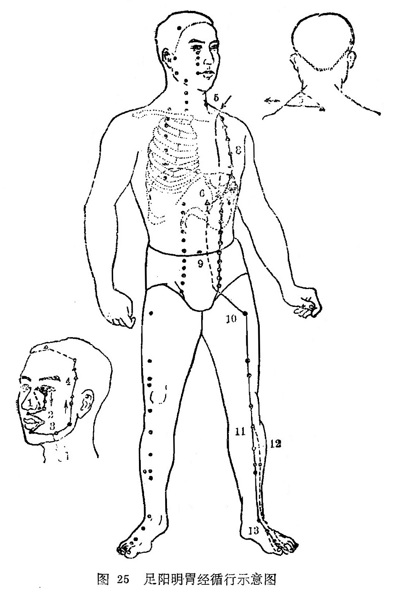

#### (一)分布络属

分布径路：本经受手阳明大肠经的支脉，起于鼻翼旁，上行在鼻根部左右侧交会，到内眼角与足太阳经相交，向下沿鼻柱外侧，进入上齿中；回出来挟口两旁，环绕口唇，在颏唇沟承浆穴处左右相交，退回来沿颌关节，经过足少阳经的上关穴（客主人），沿着鬓发边际，到额前（神庭)。

它的下行支脉，从大迎穴前方，向下经过人迎，沿喉咙，进入锁骨上窝，深入体腔，穿过膈肌，归属胃腑，联络脾脏。

它的外行经脉，从锁骨（缺盆）上窝向下，经乳头，向下挟脐二寸，到腹股沟的气街处。

它的内行经脉，从胃下口幽门部起，向下沿腹腔内，到腹股沟气街处和外行经脉相合，二支脉由此相会，再下行至髀关，直下伏兔部达胫骨前外缘，到足背上，进入足中趾外侧。

它的胫部支脉，从膝下三寸（足三里）处分出，进入足中趾外侧。

它的足跗部支脉，从跗上（冲阳）分出，进入足大趾内侧端 ，(隐白）与足太阴脾经相接。

络属脏腑：属胃，络脾。

经过器官：鼻、眼、口、上齿、乳房。

本经腧穴：

三足阳明是胃经，起于头面向下行。

**承泣**眼眶边缘下，**四白**目下一寸匀，

**巨髎**鼻旁直瞳子，**地仓**吻旁四分寻。

**大迎**颌前寸三陷，**颊车**耳下曲颊临。

**下关**耳前扪动脉，**头维**四五旁神庭。

**人**迎结喉旁寸五，**水突**迎下大筋凭。

直下**气舍**平天突，**缺盆**锁骨窝里寻。

**气户**锁下一肋上，相去中行四寸正。

库房屋翳膺窗接，都隔一肋**乳中**停。

**乳**根乳下一肋处，胸部诸穴君须明。

**不容**巨阙旁二寸，其下**承满**与梁门。

**关门太乙滑肉门，天枢**脐旁二寸平。

**外陵大巨水道**穴，**归来气冲**曲骨邻。

诸穴相隔皆一寸，但距中行二寸程。

**髀关**膝上尺二寸，**伏兔**膝上六寸呈。

**阴市**膝上方三寸，**梁丘**膝上二寸平。

 膑下陷中是**犊鼻**，膝下三寸**三里**迎。

再下六寸**上巨虚**，膝下八寸**条口**行。

再下一寸**下巨虚**，踝上八寸**丰隆**盈。

**解溪**跗上系鞋处，**冲阳**跗上五寸明。

**陷谷**庭后二寸取，次趾外侧是**内庭**。

**历兑**次趾外甲角，四十五穴须记清。

图解：胃足阳明之脉，①起于鼻，交頞中，旁纳太阳之脉，②下循鼻外、入上齿中，还出挟口，环唇，下交承浆，③却循颐后下廉，出大迎，循颊车，上耳前，过客主人，④循发际，至额颅。其支者，⑤从大迎前下人迎，循喉咙，入缺盆，下膈，⑥属胃，⑦络脾。其直者，⑧以缺盆下乳内廉，下挟脐，入气街中。其支者，⑨起于胃口，下循腹里，下至气衔中而合，⑩以下髀关、抵伏兔，下膝膑中，⑪下循胫外廉，下足跗，入中趾内间。其支者，⑫下膝三寸而别，下入中趾外间。其支者，⑬别跗上，入大趾间，出其端(《灵枢•绎脉》）。
