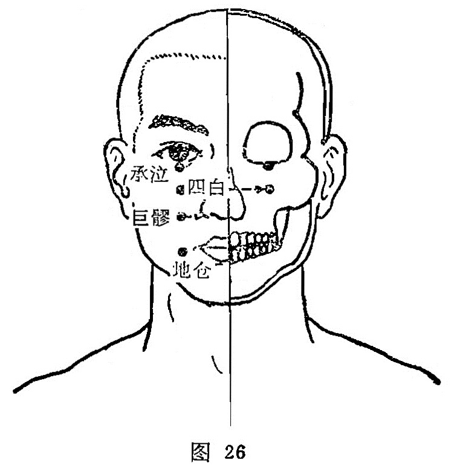

##### 承泣

〔定位〕目正视，瞳孔直下，当眶下缘与眼球之间(图26)。

〔解剖〕在眶下缘上方，眼轮匝肌中，深层眶内有眼球下直肌，下斜肌；有眶下动脉分支，静脉属支及眼球、静脉分支；布有上颌神经，眶下神经支，动眼神经支之肌支，及面神经颧支。

〔功能〕散风泻火，疏邪明目。

〔主治〕目赤肿痛，迎风流泪，夜盲，口眼㖞斜，眼睑瞤动。

〔剌灸〕押手固定眼球，沿眶下缘直刺压入0. 3〜0. 7寸，不宜大幅度捻转，禁灸。

〔讲述〕见于《甲乙》。别称鼷穴、面髎，又称溪穴，目下。承，有接受的含意；泣，指哭出的泪水。当人泣时，此处承受泪水，针此泪有收受之所，因名。穴属足阳明；阳跷、任脉之所会， 是治疗目疾的要穴。《甲乙》、《千金》皆治目不明，泪出，目眩瞀，瞳子痒，远视䀮䀮，昏夜无见，目瞤动与项口参相引，㖞僻口不能言。《铜人》：治冷泪眼眦赤痛。《大成》：治目翳绿色，从下侵上者，自阳明来也。临床常配肝俞、瞳子髎治目昏暗；配睛明、风池、太冲治青光眼；配睛明、足三里、肝俞、肾俞治视神经萎缩。穴近眼球，不宜灸治，《外台》禁灸。

