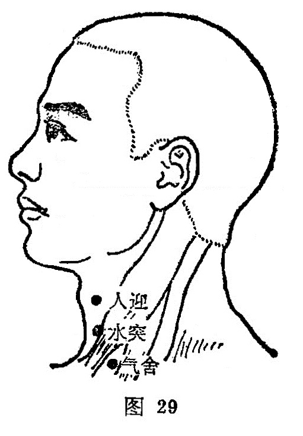

##### 气舍

〔定位〕人迎穴直下，锁骨内侧上缘，当胸锁乳突肌的胸骨 头与锁骨头之间（图29）。

〔解剖〕在颈阔肌、胸锁乳突肌的胸骨头与锁骨头之间；有颈前浅静脉，深部为颈总动脉，布有锁骨上神经前支，舌下神经肌支。

〔功能〕调气，化瘀、散结。

〔主治〕喘息，呃逆，咽喉肿痛，气瘿、瘰疬，颈项强痛。

〔刺灸〕直刺0.3〜0.5寸，可灸。

〔讲述〕见于《甲乙》。气，指空中大气；舍，指居处。穴近气管，呼吸之气流经此处，因名。本穴主治咽痛喉肿，气逆呃逆，瘿瘤瘰疬。临床常配扶突、水突治瘿瘤；配天突治咽下困难；配气户、膈俞治呃逆；配魄户治咳逆上气。

