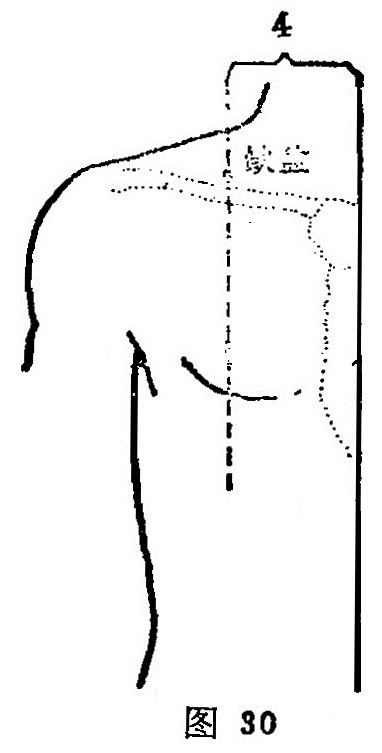

##### 缺盆

〔定位〕锁骨上窝中央，任脉旁开4寸（图30）。

〔解剖〕有颈阔肌，肩胛舌骨肌之中间腱；上方有颈横动脉，内侧有锁骨下动脉；布有锁骨上神经中支，深层正当臂丛的锁骨上部。

〔功能〕宣肺调气，清热散结。

〔主治〕咳嗽，气喘，咽喉肿痛，缺盆中痛，瘰疬。

〔刺灸〕直刺或斜刺0.3〜0.5 寸，穴下为肺尖，禁深刺、捣刺。

〔讲述〕出《灵枢• 经脉》。别称天盖。缺，指破，有不完整的含意；凹陷深处为盆。穴当锁骨上窝，是处形如破盆状，穴当其中，因名。穴下深部有肺尖，《甲乙》谓刺太深令人逆息。故不可深刺，禁用提捣术，免伤肺脏，造成气逆。本穴主要用于咳喘。临床常配膻中、巨阙治咳嗽；配食窦、少海、商阳治胸水；配肺俞治喘咳。《素问•水热论》：大杼、膺窗、缺盆、背俞，此八者，以泻胸中之热。《图翼》：孕妇禁针。
