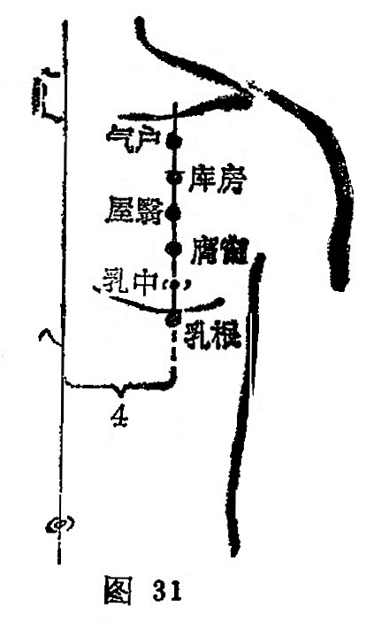

##### 库房

〔定位〕第一肋间隙，任脉旁开4寸（图31）。

〔解剖〕在胸大肌起始部，深层上方有锁骨下肌；胸肩峰动静脉之支；布有锁骨上神经，胸前神经分支。

〔功能〕理气宽胸，止咳化痰。

〔主治〕胸胁胀痛，咳嗽气逆。

〔刺灸〕向内斜刺0.5〜0.8寸，可灸。

〔讲述〕见于《甲乙》。库，指府库；房有住舍之意。因本穴主治胸胁支满，咳逆上气，犹气舍于胸中，针此可使气散结开，因名。《甲乙》：治胸胁支满，咳逆上气，呼吸多喘，浊沫脓血。临床常配中府、周荣、尺泽宣肺平喘治咳逆上气，呼吸多唾浊沫脓血。配肺俞、膻中、天突、尺泽宣肺利气治胸痛，咳嗽，吐脓血；配少泽、心俞治咳嗽；配乳根、肩井、曲泽治乳痈初发。

