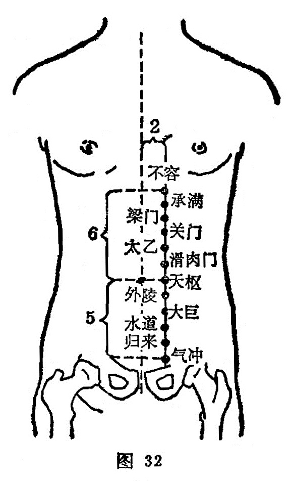

##### 关门

〔定位〕脐上3寸（建里），旁开2寸(图32)。

〔解剖〕当腹直肌及其鞘处；有第八肋间动静脉之支及腹壁上动静脉；布有第八肋间神经分支。

〔功能〕健脾和胃，通利水道。

〔主治〕腹痛，腹胀，肠鸣，泄泻，纳呆，小便不利，遗尿，水肿。

〔刺灸〕直刺0.8〜1.2寸，可灸。

〔讲述〕见于《甲乙》。关指闭门不纳，主治不思饮食，犹于闭门不受，因名。《甲乙》：治腹胀善满，积气，身肿。《外台》：治遗溺，腹胀善满，积气身肿。临床常配中脘、足三里治腹胀纳少；配委中、神门治遗溺；配三阴交、水道、关元治奔豚。

