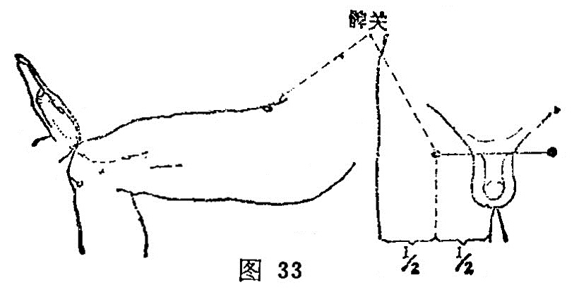

##### 髀关

〔定位〕髂前上棘与髌骨外缘连线上，平臀沟处(图33)。

〔解剖〕当缝匠肌和阔筋膜之间；深层有旋股外侧动、静脉之支；布有股外侧皮神经。

〔功能〕健腰膝，通经络。

〔主治〕下肢痿痹，股痛，屈伸不利。

〔刺灸〕直刺1〜2寸，可灸。

〔讲述〕出《素问•气府论》。通内达外之处为关，又有转动之意；股骨称髀，穴近股骨上端关节处，因名。取本穴，应请患者仰卧，从气冲穴至伏兔穴作一连线，按取大转子的前下方，在直线上，正当会阴穴平线处取之。本穴主治下肢疼痛、麻木，不得屈伸。临床常配承扶、委中治股关节痛；配环跳、承扶、风市、足三里治下肢麻痹，瘫痪。
