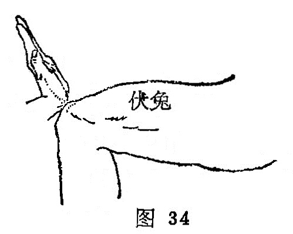

##### 伏兔

〔定位〕在髂前上棘与髌骨外缘的连线上，髌骨上缘上6寸处；或以医者一手腕横纹对准髌骨上缘，伏掌，当中指尖到达处是穴（图34、35）。

〔解剖〕在股直肌肌腹中；有旋股外侧动静脉之支；布有股前皮神经，股外侧皮神经。

〔功能〕状腰膝，通经络。

〔主治〕腰跨疼痛，腿膝寒冷，麻痹，脚气。

〔刺灸〕直剌1〜1.5寸，可灸。

〔讲述〕出《灵枢•寒热》。别称外勾。卧者为伏，穴处有股四头肌隆起，形似兔伏，穴正当其处，因名。本穴主要用治下肢痹痛，麻木不仁，屈伸不利等。临床常配环跳治下肢痹痛，配环跳；肾俞、委中、阳陵泉、三阴交治下肢麻痹，瘫痪。《千金》：凡脚气初得脚弱，使速灸之……初灸风市，次灸伏兔，次灸犊鼻，次灸两膝眼，次灸三里，次灸上廉，次灸下廉，次灸绝骨。
