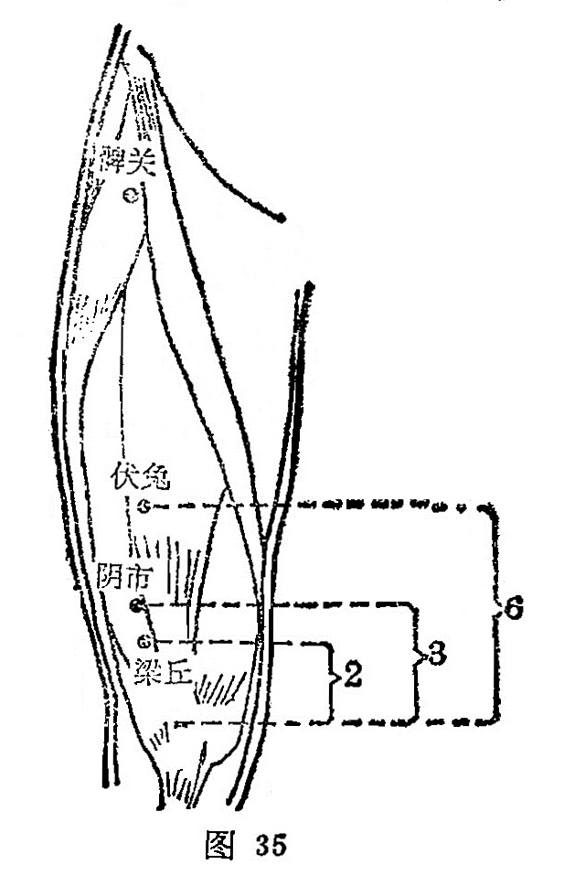

##### 阴市

〔定位〕髌骨外上缘上3寸，当髂前上棘与髌骨外上缘的连线上取穴（图35）。

〔解剖〕在股直肌和股外侧肌之间；有旋股外侧动脉降支；布有股前皮神经，股外侧皮神经。

〔功能〕温下焦，强腰膝，散寒湿。

〔主治〕膝冷无力，腹胀，疝气，水肿，消渴，下肢不遂。

〔刺灸〕直刺1〜1.2寸，可灸。

〔讲述〕见于《甲乙》。别称阴鼎。阴指内侧，集结之处为市，穴在大腿内侧，主治寒疝，膝冷如冰，针之能散寒温经，因名。《铜人》：治腰脚如冷水，膝寒，痿痹不仁，不屈伸；膝以下伏兔上寒。临床常配太冲、关元、肝俞治寒疝腹痛；配阳关治两腿如冰；配风市治腿脚无力；配少海治心痛手颤。

