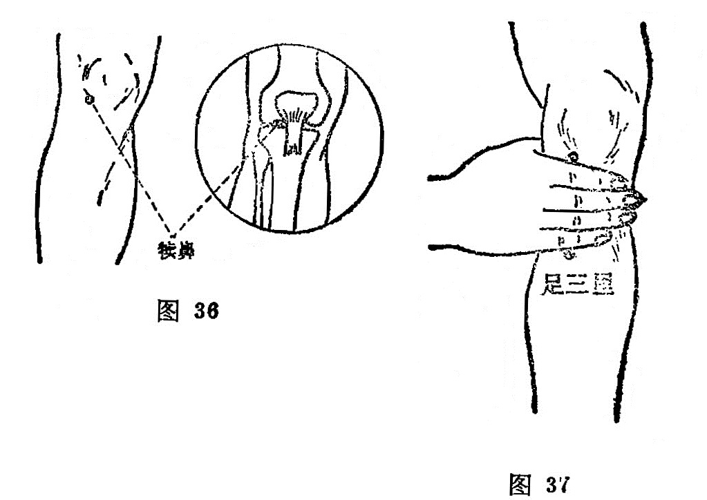

##### 足三里

〔定位〕犊鼻穴下3寸处，当胫骨前嵴外1横指；或犊鼻下四横指处，屈膝或平卧取穴（图37)。

〔解剖〕在胫骨前肌，外侧伸趾长肌之间；有胫前动静脉；有腓肠外侧皮神经及隐神经的皮支，深层为腓深神经。

〔功能〕调理脾胃，扶正培元，通经活络。

〔主治〕胃痛，呕吐，腹胀，噎膈，泄泻，痢疾，肠鸣，衝积，便秘，下肢 疼痛，虚劳羸瘦。

〔刺灸〕直刺1〜1.5寸，可灸。

〔讲述〕出《灵•本输》。别称下陵、鬼邪。里，有邑、居及集会、通达之意，又引伸为寸；三，指膝下三寸。

穴在膝下三寸，是胃气之大会所，因名。穴属本经合穴，阳经之合属土，胃亦属土，故穴为土中之土穴，又系胃之下合穴，有统治一切胃肠消化系统疾病的功效，所以马丹阳归纳在十二穴之内，又为四总穴之一：“肚腹三里留”。凡属脾胃失调，运化失职，刺灸皆有卓效。《灵枢•邪气脏腑病形》：胃病者，……取之足三里。本穴所以能治胃病，由于胃经循行于胸腹深部的脉气是属胃络脾，而肚腹之疾，一般都与脾胃有关，刺灸三里能和中调胃，而降上逆之气，中州调，受纳有权，故言三里统治脾胃疾病。近年在X光下观察，针刺三里，可使胃肠蠕动增强，分泌增多，说明三里能调整胃肠活动功能，具有健脾强胃的作用。据此，凡属胃寒，肠鸣下泄的脾虚症，宜针后加灸，有散寒化湿，补中健脾，温运脾阳之效。《灵枢•五乱》：气在肠胃者，取之足太阴阳明，不下者取足三里。

由于刺灸足三里能健脾强胃，生化气血，补益强壮，故又可用治瘦弱虚损之疾，如华佗用治五劳羸瘦，七伤虚乏。《通玄指要》：三里却五劳之羸瘦。《医说》记有：“若要安，三里莫要干” 的保健灸法。

本穴能补益中气，故又有回阳固脱之效，因此前人把它列为回阳九针穴之一。凡久病元气衰微，急症阳气暴脱，灸之皆效。刺灸本穴还能宣通气机，导气下行，故又可用治气膨之疾。凡七情郁结，气机闭塞，升降失常者，针泻可收宽中开郁之效。临床常配行间治胃痛胁胀满；配太白、章门治腹胀呕泄，食不化；配行间、曲泉治腹胀满；配上巨虚治肠中雷鸣，气上冲胸，喘不能立；配水分、阴交治蛊胀；配中脘治胃停宿食；配气海治五淋；配公孙清胃降逆，治宿食积滞；配百会、长强升阳陷，治脱肛；配归来、百会治阴挺。近代配下巨虚、阳陵泉治胰腺炎；配合谷、天枢治消化不良；配合谷、中脘、天枢、大肠俞、次髎治急性肠梗阻；配风池、太冲、人迎治高血压；配中脘、印堂治低血压；配大椎、肝俞、膈俞治贫血虚弱。

