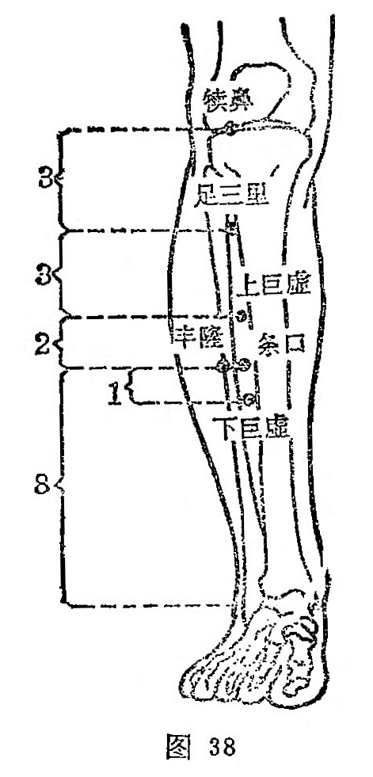

##### 上巨虚

〔定位〕犊鼻穴下6寸，当足三里与下巨虚连线的中点处（图38）。

〔解剖〕在胫骨前肌上；有胫前动静脉；布有腓肠外侧皮神经及隐神经的皮支，深层正当腓深神经。

〔功能〕调和脾胃，通腑化滞。

〔主治〕腹痛，腹胀，肠鸣，痢疾，泄泻，便秘，肠痈，下肢不遂。

〔刺灸〕直刺O. 5〜1.2寸 ，可灸。

〔讲述〕串《灵枢•本输》。巨指大，空缺凹陷之处为虚。本穴牵少腿外侧，大空隙（条口）之上，昔以大为上胃，因名。穴属足阳明与大肠下合穴，主治肠胃诸疾。《灵枢•邪气脏腑病形》：治大肠病者，肠中切痛而鸣濯濯，冬日重感于寒则泄，当脐而痛。《甲乙》：治大肠有热，肠侠脐痛，食不化，飧泄，大肠痈。临床常配天枢治腹泻；配曲池、公孙、内关治痢疾。配中脘、四缝能消食导滞，治饮食停滞之泄泻症；配阴陵泉能清利湿热，治湿热蕴结的泄泻；配天枢、阴陵泉、水分、神阙能温散寒湿，治寒泄；配关元、肾俞、脾俞能温补命火，益脾止泻，治肾泄；配太冲能疏肝理气，治气滞泄泻；配阑尾、天枢、三阴交能通肠泄热，祛瘀散结，治肠痈。

